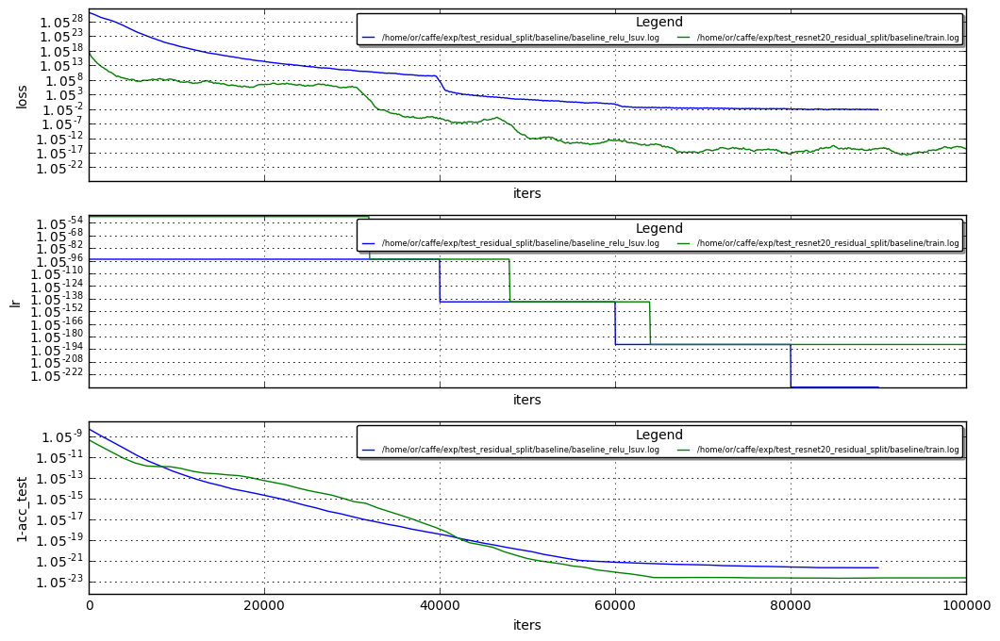

# Comparing TPM diversity on Resnet20 vs Fitnet4

Hi , see below the comparison of the TPM diversity between the two case studies.<br>
The TPM were calculated between iters 25k-55k when both nets gives a sharp decline in loss , yielding the majority of the training performance. 

Showing below blue curve is Fitnet4, green curve in Resnet20


```python
%run ~/caffe/utils/plot_loss.py ~/caffe/exp/test_residual_split/baseline/baseline_relu_lsuv.log \
                                /home/or/caffe/exp/test_resnet20_residual_split/baseline/train.log  --no_refresh
```





### Fitnet4 TPM per kernel


```python
! cat /home/or/caffe/exp/test_residual_split/baseline/path.log | grep -A 99999 "with mean"
```

    (2, 'conv1_1') with mean 0.540726191178
    # NumSamples = 32; Min = 0.32; Max = 0.90
    # each ∎ represents a count of 1
         0.3156 -     0.3737 [     1]: ∎ (3.12%)
         0.3737 -     0.4318 [     4]: ∎∎∎∎ (12.50%)
         0.4318 -     0.4899 [     8]: ∎∎∎∎∎∎∎∎ (25.00%)
         0.4899 -     0.5480 [     6]: ∎∎∎∎∎∎ (18.75%)
         0.5480 -     0.6061 [     5]: ∎∎∎∎∎ (15.62%)
         0.6061 -     0.6642 [     3]: ∎∎∎ (9.38%)
         0.6642 -     0.7223 [     0]:  (0.00%)
         0.7223 -     0.7804 [     4]: ∎∎∎∎ (12.50%)
         0.7804 -     0.8385 [     0]:  (0.00%)
         0.8385 -     0.8966 [     1]: ∎ (3.12%)
    ratio entropy 2.13394146356
    (4, 'conv1_2') with mean 0.572194506613
    # NumSamples = 32; Min = 0.50; Max = 0.69
    # each ∎ represents a count of 1
         0.5002 -     0.5191 [     4]: ∎∎∎∎ (12.50%)
         0.5191 -     0.5380 [     3]: ∎∎∎ (9.38%)
         0.5380 -     0.5570 [     3]: ∎∎∎ (9.38%)
         0.5570 -     0.5759 [     6]: ∎∎∎∎∎∎ (18.75%)
         0.5759 -     0.5948 [     7]: ∎∎∎∎∎∎∎ (21.88%)
         0.5948 -     0.6138 [     7]: ∎∎∎∎∎∎∎ (21.88%)
         0.6138 -     0.6327 [     1]: ∎ (3.12%)
         0.6327 -     0.6516 [     0]:  (0.00%)
         0.6516 -     0.6706 [     0]:  (0.00%)
         0.6706 -     0.6895 [     1]: ∎ (3.12%)
    ratio entropy 1.10477602787
    (6, 'conv1_3') with mean 0.516849031702
    # NumSamples = 32; Min = 0.44; Max = 0.57
    # each ∎ represents a count of 1
         0.4409 -     0.4537 [     1]: ∎ (3.12%)
         0.4537 -     0.4666 [     1]: ∎ (3.12%)
         0.4666 -     0.4795 [     0]:  (0.00%)
         0.4795 -     0.4923 [     2]: ∎∎ (6.25%)
         0.4923 -     0.5052 [     8]: ∎∎∎∎∎∎∎∎ (25.00%)
         0.5052 -     0.5181 [     7]: ∎∎∎∎∎∎∎ (21.88%)
         0.5181 -     0.5309 [     4]: ∎∎∎∎ (12.50%)
         0.5309 -     0.5438 [     2]: ∎∎ (6.25%)
         0.5438 -     0.5566 [     3]: ∎∎∎ (9.38%)
         0.5566 -     0.5695 [     4]: ∎∎∎∎ (12.50%)
    ratio entropy 1.09114722758
    (8, 'conv1_4') with mean 0.509076949161
    # NumSamples = 48; Min = 0.46; Max = 0.59
    # each ∎ represents a count of 1
         0.4572 -     0.4708 [     3]: ∎∎∎ (6.25%)
         0.4708 -     0.4843 [     9]: ∎∎∎∎∎∎∎∎∎ (18.75%)
         0.4843 -     0.4979 [     7]: ∎∎∎∎∎∎∎ (14.58%)
         0.4979 -     0.5115 [    11]: ∎∎∎∎∎∎∎∎∎∎∎ (22.92%)
         0.5115 -     0.5251 [     5]: ∎∎∎∎∎ (10.42%)
         0.5251 -     0.5386 [     5]: ∎∎∎∎∎ (10.42%)
         0.5386 -     0.5522 [     4]: ∎∎∎∎ (8.33%)
         0.5522 -     0.5658 [     2]: ∎∎ (4.17%)
         0.5658 -     0.5794 [     0]:  (0.00%)
         0.5794 -     0.5929 [     2]: ∎∎ (4.17%)
    ratio entropy 0.982281505484
    (10, 'conv1_5') with mean 0.496731072858
    # NumSamples = 48; Min = 0.45; Max = 0.53
    # each ∎ represents a count of 1
         0.4534 -     0.4615 [     2]: ∎∎ (4.17%)
         0.4615 -     0.4696 [     2]: ∎∎ (4.17%)
         0.4696 -     0.4777 [     3]: ∎∎∎ (6.25%)
         0.4777 -     0.4858 [    10]: ∎∎∎∎∎∎∎∎∎∎ (20.83%)
         0.4858 -     0.4938 [     2]: ∎∎ (4.17%)
         0.4938 -     0.5019 [     8]: ∎∎∎∎∎∎∎∎ (16.67%)
         0.5019 -     0.5100 [     9]: ∎∎∎∎∎∎∎∎∎ (18.75%)
         0.5100 -     0.5181 [     3]: ∎∎∎ (6.25%)
         0.5181 -     0.5262 [     4]: ∎∎∎∎ (8.33%)
         0.5262 -     0.5343 [     5]: ∎∎∎∎∎ (10.42%)
    ratio entropy 0.685314207276
    (14, 'conv2_1') with mean 0.488343569804
    # NumSamples = 80; Min = 0.41; Max = 0.76
    # each ∎ represents a count of 1
         0.4109 -     0.4456 [    15]: ∎∎∎∎∎∎∎∎∎∎∎∎∎∎∎ (18.75%)
         0.4456 -     0.4803 [    23]: ∎∎∎∎∎∎∎∎∎∎∎∎∎∎∎∎∎∎∎∎∎∎∎ (28.75%)
         0.4803 -     0.5151 [    24]: ∎∎∎∎∎∎∎∎∎∎∎∎∎∎∎∎∎∎∎∎∎∎∎∎ (30.00%)
         0.5151 -     0.5498 [    11]: ∎∎∎∎∎∎∎∎∎∎∎ (13.75%)
         0.5498 -     0.5846 [     2]: ∎∎ (2.50%)
         0.5846 -     0.6193 [     2]: ∎∎ (2.50%)
         0.6193 -     0.6540 [     2]: ∎∎ (2.50%)
         0.6540 -     0.6888 [     0]:  (0.00%)
         0.6888 -     0.7235 [     0]:  (0.00%)
         0.7235 -     0.7582 [     1]: ∎ (1.25%)
    ratio entropy 1.35458247054
    (16, 'conv2_2') with mean 0.530369418433
    # NumSamples = 80; Min = 0.47; Max = 0.80
    # each ∎ represents a count of 1
         0.4727 -     0.5053 [    18]: ∎∎∎∎∎∎∎∎∎∎∎∎∎∎∎∎∎∎ (22.50%)
         0.5053 -     0.5379 [    38]: ∎∎∎∎∎∎∎∎∎∎∎∎∎∎∎∎∎∎∎∎∎∎∎∎∎∎∎∎∎∎∎∎∎∎∎∎∎∎ (47.50%)
         0.5379 -     0.5706 [    17]: ∎∎∎∎∎∎∎∎∎∎∎∎∎∎∎∎∎ (21.25%)
         0.5706 -     0.6032 [     5]: ∎∎∎∎∎ (6.25%)
         0.6032 -     0.6358 [     1]: ∎ (1.25%)
         0.6358 -     0.6684 [     0]:  (0.00%)
         0.6684 -     0.7011 [     0]:  (0.00%)
         0.7011 -     0.7337 [     0]:  (0.00%)
         0.7337 -     0.7663 [     0]:  (0.00%)
         0.7663 -     0.7990 [     1]: ∎ (1.25%)
    ratio entropy 0.94909725622
    (18, 'conv2_3') with mean 0.519674160081
    # NumSamples = 80; Min = 0.46; Max = 0.61
    # each ∎ represents a count of 1
         0.4625 -     0.4774 [     5]: ∎∎∎∎∎ (6.25%)
         0.4774 -     0.4923 [     1]: ∎ (1.25%)
         0.4923 -     0.5071 [    20]: ∎∎∎∎∎∎∎∎∎∎∎∎∎∎∎∎∎∎∎∎ (25.00%)
         0.5071 -     0.5220 [    21]: ∎∎∎∎∎∎∎∎∎∎∎∎∎∎∎∎∎∎∎∎∎ (26.25%)
         0.5220 -     0.5368 [    12]: ∎∎∎∎∎∎∎∎∎∎∎∎ (15.00%)
         0.5368 -     0.5517 [    12]: ∎∎∎∎∎∎∎∎∎∎∎∎ (15.00%)
         0.5517 -     0.5666 [     6]: ∎∎∎∎∎∎ (7.50%)
         0.5666 -     0.5814 [     2]: ∎∎ (2.50%)
         0.5814 -     0.5963 [     0]:  (0.00%)
         0.5963 -     0.6111 [     1]: ∎ (1.25%)
    ratio entropy 0.864523171211
    (20, 'conv2_4') with mean 0.52609279351
    # NumSamples = 80; Min = 0.48; Max = 0.58
    # each ∎ represents a count of 1
         0.4793 -     0.4894 [     2]: ∎∎ (2.50%)
         0.4894 -     0.4994 [     5]: ∎∎∎∎∎ (6.25%)
         0.4994 -     0.5095 [    10]: ∎∎∎∎∎∎∎∎∎∎ (12.50%)
         0.5095 -     0.5195 [    10]: ∎∎∎∎∎∎∎∎∎∎ (12.50%)
         0.5195 -     0.5295 [    24]: ∎∎∎∎∎∎∎∎∎∎∎∎∎∎∎∎∎∎∎∎∎∎∎∎ (30.00%)
         0.5295 -     0.5396 [    14]: ∎∎∎∎∎∎∎∎∎∎∎∎∎∎ (17.50%)
         0.5396 -     0.5496 [     2]: ∎∎ (2.50%)
         0.5496 -     0.5597 [     6]: ∎∎∎∎∎∎ (7.50%)
         0.5597 -     0.5697 [     5]: ∎∎∎∎∎ (6.25%)
         0.5697 -     0.5798 [     2]: ∎∎ (2.50%)
    ratio entropy 0.730588061371
    (22, 'conv2_5') with mean 0.506916409597
    # NumSamples = 80; Min = 0.46; Max = 0.57
    # each ∎ represents a count of 1
         0.4627 -     0.4738 [     5]: ∎∎∎∎∎ (6.25%)
         0.4738 -     0.4849 [     5]: ∎∎∎∎∎ (6.25%)
         0.4849 -     0.4961 [    14]: ∎∎∎∎∎∎∎∎∎∎∎∎∎∎ (17.50%)
         0.4961 -     0.5072 [    13]: ∎∎∎∎∎∎∎∎∎∎∎∎∎ (16.25%)
         0.5072 -     0.5183 [    24]: ∎∎∎∎∎∎∎∎∎∎∎∎∎∎∎∎∎∎∎∎∎∎∎∎ (30.00%)
         0.5183 -     0.5294 [    10]: ∎∎∎∎∎∎∎∎∎∎ (12.50%)
         0.5294 -     0.5405 [     6]: ∎∎∎∎∎∎ (7.50%)
         0.5405 -     0.5516 [     1]: ∎ (1.25%)
         0.5516 -     0.5627 [     1]: ∎ (1.25%)
         0.5627 -     0.5738 [     1]: ∎ (1.25%)
    ratio entropy 0.745814172022
    (24, 'conv2_6') with mean 0.485471081566
    # NumSamples = 80; Min = 0.44; Max = 0.52
    # each ∎ represents a count of 1
         0.4396 -     0.4476 [     2]: ∎∎ (2.50%)
         0.4476 -     0.4557 [     0]:  (0.00%)
         0.4557 -     0.4637 [     3]: ∎∎∎ (3.75%)
         0.4637 -     0.4718 [    13]: ∎∎∎∎∎∎∎∎∎∎∎∎∎ (16.25%)
         0.4718 -     0.4798 [    15]: ∎∎∎∎∎∎∎∎∎∎∎∎∎∎∎ (18.75%)
         0.4798 -     0.4879 [     9]: ∎∎∎∎∎∎∎∎∎ (11.25%)
         0.4879 -     0.4959 [    16]: ∎∎∎∎∎∎∎∎∎∎∎∎∎∎∎∎ (20.00%)
         0.4959 -     0.5040 [    13]: ∎∎∎∎∎∎∎∎∎∎∎∎∎ (16.25%)
         0.5040 -     0.5120 [     2]: ∎∎ (2.50%)
         0.5120 -     0.5201 [     7]: ∎∎∎∎∎∎∎ (8.75%)
    ratio entropy 0.556204027782
    (28, 'conv3_1') with mean 0.482094732771
    # NumSamples = 128; Min = 0.43; Max = 0.57
    # each ∎ represents a count of 1
         0.4346 -     0.4486 [    10]: ∎∎∎∎∎∎∎∎∎∎ (7.81%)
         0.4486 -     0.4625 [    18]: ∎∎∎∎∎∎∎∎∎∎∎∎∎∎∎∎∎∎ (14.06%)
         0.4625 -     0.4765 [    28]: ∎∎∎∎∎∎∎∎∎∎∎∎∎∎∎∎∎∎∎∎∎∎∎∎∎∎∎∎ (21.88%)
         0.4765 -     0.4905 [    32]: ∎∎∎∎∎∎∎∎∎∎∎∎∎∎∎∎∎∎∎∎∎∎∎∎∎∎∎∎∎∎∎∎ (25.00%)
         0.4905 -     0.5044 [    18]: ∎∎∎∎∎∎∎∎∎∎∎∎∎∎∎∎∎∎ (14.06%)
         0.5044 -     0.5184 [    13]: ∎∎∎∎∎∎∎∎∎∎∎∎∎ (10.16%)
         0.5184 -     0.5323 [     3]: ∎∎∎ (2.34%)
         0.5323 -     0.5463 [     2]: ∎∎ (1.56%)
         0.5463 -     0.5602 [     2]: ∎∎ (1.56%)
         0.5602 -     0.5742 [     2]: ∎∎ (1.56%)
    ratio entropy 0.849864116059
    (30, 'conv3_2') with mean 0.507922817588
    # NumSamples = 128; Min = 0.47; Max = 0.57
    # each ∎ represents a count of 1
         0.4706 -     0.4801 [     8]: ∎∎∎∎∎∎∎∎ (6.25%)
         0.4801 -     0.4896 [    13]: ∎∎∎∎∎∎∎∎∎∎∎∎∎ (10.16%)
         0.4896 -     0.4991 [    28]: ∎∎∎∎∎∎∎∎∎∎∎∎∎∎∎∎∎∎∎∎∎∎∎∎∎∎∎∎ (21.88%)
         0.4991 -     0.5087 [    15]: ∎∎∎∎∎∎∎∎∎∎∎∎∎∎∎ (11.72%)
         0.5087 -     0.5182 [    26]: ∎∎∎∎∎∎∎∎∎∎∎∎∎∎∎∎∎∎∎∎∎∎∎∎∎∎ (20.31%)
         0.5182 -     0.5277 [    24]: ∎∎∎∎∎∎∎∎∎∎∎∎∎∎∎∎∎∎∎∎∎∎∎∎ (18.75%)
         0.5277 -     0.5372 [     6]: ∎∎∎∎∎∎ (4.69%)
         0.5372 -     0.5467 [     5]: ∎∎∎∎∎ (3.91%)
         0.5467 -     0.5562 [     2]: ∎∎ (1.56%)
         0.5562 -     0.5657 [     1]: ∎ (0.78%)
    ratio entropy 0.74483487216
    (32, 'conv3_3') with mean 0.511509094672
    # NumSamples = 128; Min = 0.46; Max = 0.59
    # each ∎ represents a count of 1
         0.4595 -     0.4722 [     1]: ∎ (0.78%)
         0.4722 -     0.4848 [     8]: ∎∎∎∎∎∎∎∎ (6.25%)
         0.4848 -     0.4974 [    25]: ∎∎∎∎∎∎∎∎∎∎∎∎∎∎∎∎∎∎∎∎∎∎∎∎∎ (19.53%)
         0.4974 -     0.5100 [    24]: ∎∎∎∎∎∎∎∎∎∎∎∎∎∎∎∎∎∎∎∎∎∎∎∎ (18.75%)
         0.5100 -     0.5226 [    35]: ∎∎∎∎∎∎∎∎∎∎∎∎∎∎∎∎∎∎∎∎∎∎∎∎∎∎∎∎∎∎∎∎∎∎∎ (27.34%)
         0.5226 -     0.5352 [    23]: ∎∎∎∎∎∎∎∎∎∎∎∎∎∎∎∎∎∎∎∎∎∎∎ (17.97%)
         0.5352 -     0.5479 [     7]: ∎∎∎∎∎∎∎ (5.47%)
         0.5479 -     0.5605 [     2]: ∎∎ (1.56%)
         0.5605 -     0.5731 [     1]: ∎ (0.78%)
         0.5731 -     0.5857 [     2]: ∎∎ (1.56%)
    ratio entropy 0.765196632169
    (34, 'conv3_4') with mean 0.519897144123
    # NumSamples = 128; Min = 0.47; Max = 0.61
    # each ∎ represents a count of 1
         0.4729 -     0.4868 [     4]: ∎∎∎∎ (3.12%)
         0.4868 -     0.5006 [    11]: ∎∎∎∎∎∎∎∎∎∎∎ (8.59%)
         0.5006 -     0.5145 [    36]: ∎∎∎∎∎∎∎∎∎∎∎∎∎∎∎∎∎∎∎∎∎∎∎∎∎∎∎∎∎∎∎∎∎∎∎∎ (28.12%)
         0.5145 -     0.5284 [    39]: ∎∎∎∎∎∎∎∎∎∎∎∎∎∎∎∎∎∎∎∎∎∎∎∎∎∎∎∎∎∎∎∎∎∎∎∎∎∎∎ (30.47%)
         0.5284 -     0.5422 [    23]: ∎∎∎∎∎∎∎∎∎∎∎∎∎∎∎∎∎∎∎∎∎∎∎ (17.97%)
         0.5422 -     0.5561 [     9]: ∎∎∎∎∎∎∎∎∎ (7.03%)
         0.5561 -     0.5700 [     5]: ∎∎∎∎∎ (3.91%)
         0.5700 -     0.5839 [     0]:  (0.00%)
         0.5839 -     0.5977 [     0]:  (0.00%)
         0.5977 -     0.6116 [     1]: ∎ (0.78%)
    ratio entropy 0.610561819963
    (36, 'conv3_5') with mean 0.523288686425
    # NumSamples = 128; Min = 0.47; Max = 0.98
    # each ∎ represents a count of 1
         0.4691 -     0.5204 [    73]: ∎∎∎∎∎∎∎∎∎∎∎∎∎∎∎∎∎∎∎∎∎∎∎∎∎∎∎∎∎∎∎∎∎∎∎∎∎∎∎∎∎∎∎∎∎∎∎∎∎∎∎∎∎∎∎∎∎∎∎∎∎∎∎∎∎∎∎∎∎∎∎∎∎ (57.03%)
         0.5204 -     0.5717 [    50]: ∎∎∎∎∎∎∎∎∎∎∎∎∎∎∎∎∎∎∎∎∎∎∎∎∎∎∎∎∎∎∎∎∎∎∎∎∎∎∎∎∎∎∎∎∎∎∎∎∎∎ (39.06%)
         0.5717 -     0.6230 [     3]: ∎∎∎ (2.34%)
         0.6230 -     0.6743 [     1]: ∎ (0.78%)
         0.6743 -     0.7256 [     0]:  (0.00%)
         0.7256 -     0.7769 [     0]:  (0.00%)
         0.7769 -     0.8282 [     0]:  (0.00%)
         0.8282 -     0.8796 [     0]:  (0.00%)
         0.8796 -     0.9309 [     0]:  (0.00%)
         0.9309 -     0.9822 [     1]: ∎ (0.78%)
    ratio entropy 0.872748678436
    (38, 'conv3_6') with mean 0.502805383888
    # NumSamples = 128; Min = 0.47; Max = 0.55
    # each ∎ represents a count of 1
         0.4665 -     0.4751 [     7]: ∎∎∎∎∎∎∎ (5.47%)
         0.4751 -     0.4836 [     9]: ∎∎∎∎∎∎∎∎∎ (7.03%)
         0.4836 -     0.4922 [    20]: ∎∎∎∎∎∎∎∎∎∎∎∎∎∎∎∎∎∎∎∎ (15.62%)
         0.4922 -     0.5007 [    21]: ∎∎∎∎∎∎∎∎∎∎∎∎∎∎∎∎∎∎∎∎∎ (16.41%)
         0.5007 -     0.5093 [    27]: ∎∎∎∎∎∎∎∎∎∎∎∎∎∎∎∎∎∎∎∎∎∎∎∎∎∎∎ (21.09%)
         0.5093 -     0.5178 [    20]: ∎∎∎∎∎∎∎∎∎∎∎∎∎∎∎∎∎∎∎∎ (15.62%)
         0.5178 -     0.5264 [    13]: ∎∎∎∎∎∎∎∎∎∎∎∎∎ (10.16%)
         0.5264 -     0.5349 [     7]: ∎∎∎∎∎∎∎ (5.47%)
         0.5349 -     0.5435 [     3]: ∎∎∎ (2.34%)
         0.5435 -     0.5520 [     1]: ∎ (0.78%)
    ratio entropy 0.728213160716
    (42, 'ip1') with mean 0.468616331966
    # NumSamples = 500; Min = 0.37; Max = 1.00
    # each ∎ represents a count of 4
         0.3664 -     0.4295 [    94]: ∎∎∎∎∎∎∎∎∎∎∎∎∎∎∎∎∎∎∎∎∎∎∎ (18.80%)
         0.4295 -     0.4927 [   329]: ∎∎∎∎∎∎∎∎∎∎∎∎∎∎∎∎∎∎∎∎∎∎∎∎∎∎∎∎∎∎∎∎∎∎∎∎∎∎∎∎∎∎∎∎∎∎∎∎∎∎∎∎∎∎∎∎∎∎∎∎∎∎∎∎∎∎∎∎∎∎∎∎∎∎∎∎∎∎∎∎∎∎ (65.80%)
         0.4927 -     0.5558 [    58]: ∎∎∎∎∎∎∎∎∎∎∎∎∎∎ (11.60%)
         0.5558 -     0.6189 [     8]: ∎∎ (1.60%)
         0.6189 -     0.6820 [     1]:  (0.20%)
         0.6820 -     0.7452 [     1]:  (0.20%)
         0.7452 -     0.8083 [     0]:  (0.00%)
         0.8083 -     0.8714 [     1]:  (0.20%)
         0.8714 -     0.9346 [     1]:  (0.20%)
         0.9346 -     0.9977 [     7]: ∎ (1.40%)
    ratio entropy 1.15501684748
    (45, 'clf') with mean 0.450423596457
    # NumSamples = 100; Min = 0.40; Max = 0.53
    # each ∎ represents a count of 1
         0.3965 -     0.4102 [     6]: ∎∎∎∎∎∎ (6.00%)
         0.4102 -     0.4238 [    12]: ∎∎∎∎∎∎∎∎∎∎∎∎ (12.00%)
         0.4238 -     0.4374 [    16]: ∎∎∎∎∎∎∎∎∎∎∎∎∎∎∎∎ (16.00%)
         0.4374 -     0.4511 [    21]: ∎∎∎∎∎∎∎∎∎∎∎∎∎∎∎∎∎∎∎∎∎ (21.00%)
         0.4511 -     0.4647 [    14]: ∎∎∎∎∎∎∎∎∎∎∎∎∎∎ (14.00%)
         0.4647 -     0.4783 [    18]: ∎∎∎∎∎∎∎∎∎∎∎∎∎∎∎∎∎∎ (18.00%)
         0.4783 -     0.4920 [     6]: ∎∎∎∎∎∎ (6.00%)
         0.4920 -     0.5056 [     3]: ∎∎∎ (3.00%)
         0.5056 -     0.5192 [     1]: ∎ (1.00%)
         0.5192 -     0.5329 [     3]: ∎∎∎ (3.00%)
    ratio entropy 0.877755628133
    Mean TPM ratio entropy = 0.927628757083
    ('conv1_1', 32) 2.13394146356
    ('conv2_1', 80) 1.35458247054
    ('conv1_2', 32) 1.10477602787
    ('conv1_3', 32) 1.09114722758
    ('conv1_4', 48) 0.982281505484
    ('conv2_2', 80) 0.94909725622
    ('conv3_5', 128) 0.872748678436
    ('conv2_3', 80) 0.864523171211
    ('conv3_1', 128) 0.849864116059
    ('conv3_3', 128) 0.765196632169
    ('conv2_5', 80) 0.745814172022
    ('conv3_2', 128) 0.74483487216
    ('conv2_4', 80) 0.730588061371
    ('conv3_6', 128) 0.728213160716
    ('conv1_5', 48) 0.685314207276
    ('conv3_4', 128) 0.610561819963
    ('conv2_6', 80) 0.556204027782


### Resnet4 TPM per kernel


```python
! cat /home/or/caffe/exp/test_resnet20_residual_split/baseline/path.log | grep -A 99999 "with mean"
```

    (1, 'first_conv') with mean 0.53470375605
    # NumSamples = 16; Min = 0.43; Max = 0.62
    # each ∎ represents a count of 1
         0.4315 -     0.4508 [     1]: ∎ (6.25%)
         0.4508 -     0.4702 [     1]: ∎ (6.25%)
         0.4702 -     0.4895 [     1]: ∎ (6.25%)
         0.4895 -     0.5088 [     2]: ∎∎ (12.50%)
         0.5088 -     0.5281 [     2]: ∎∎ (12.50%)
         0.5281 -     0.5474 [     3]: ∎∎∎ (18.75%)
         0.5474 -     0.5668 [     1]: ∎ (6.25%)
         0.5668 -     0.5861 [     2]: ∎∎ (12.50%)
         0.5861 -     0.6054 [     1]: ∎ (6.25%)
         0.6054 -     0.6247 [     2]: ∎∎ (12.50%)
    ratio entropy 1.40139264661
    (2, 'first_conv_bn') with mean 0.288701445674
    # NumSamples = 16; Min = 0.00; Max = 1.00
    # each ∎ represents a count of 1
         0.0041 -     0.1037 [     6]: ∎∎∎∎∎∎ (37.50%)
         0.1037 -     0.2033 [     2]: ∎∎ (12.50%)
         0.2033 -     0.3029 [     3]: ∎∎∎ (18.75%)
         0.3029 -     0.4025 [     1]: ∎ (6.25%)
         0.4025 -     0.5021 [     1]: ∎ (6.25%)
         0.5021 -     0.6017 [     0]:  (0.00%)
         0.6017 -     0.7012 [     1]: ∎ (6.25%)
         0.7012 -     0.8008 [     0]:  (0.00%)
         0.8008 -     0.9004 [     1]: ∎ (6.25%)
         0.9004 -     1.0000 [     1]: ∎ (6.25%)
    ratio entropy 2.15353245665
    (3, 'first_conv_scale') with mean 0.900494017929
    # NumSamples = 16; Min = 0.45; Max = 1.00
    # each ∎ represents a count of 1
         0.4478 -     0.5030 [     1]: ∎ (6.25%)
         0.5030 -     0.5582 [     1]: ∎ (6.25%)
         0.5582 -     0.6134 [     0]:  (0.00%)
         0.6134 -     0.6687 [     0]:  (0.00%)
         0.6687 -     0.7239 [     1]: ∎ (6.25%)
         0.7239 -     0.7791 [     0]:  (0.00%)
         0.7791 -     0.8343 [     0]:  (0.00%)
         0.8343 -     0.8896 [     1]: ∎ (6.25%)
         0.8896 -     0.9448 [     1]: ∎ (6.25%)
         0.9448 -     1.0000 [    11]: ∎∎∎∎∎∎∎∎∎∎∎ (68.75%)
    ratio entropy 1.60943791243
    (6, 'group0_block0_conv0') with mean 0.443637200755
    # NumSamples = 16; Min = 0.38; Max = 0.53
    # each ∎ represents a count of 1
         0.3800 -     0.3951 [     1]: ∎ (6.25%)
         0.3951 -     0.4101 [     0]:  (0.00%)
         0.4101 -     0.4251 [     1]: ∎ (6.25%)
         0.4251 -     0.4401 [     6]: ∎∎∎∎∎∎ (37.50%)
         0.4401 -     0.4552 [     3]: ∎∎∎ (18.75%)
         0.4552 -     0.4702 [     3]: ∎∎∎ (18.75%)
         0.4702 -     0.4852 [     1]: ∎ (6.25%)
         0.4852 -     0.5003 [     0]:  (0.00%)
         0.5003 -     0.5153 [     0]:  (0.00%)
         0.5153 -     0.5303 [     1]: ∎ (6.25%)
    ratio entropy 1.03370054985
    (7, 'group0_block0_conv0_bn') with mean 0.886417065886
    # NumSamples = 16; Min = 0.08; Max = 1.00
    # each ∎ represents a count of 1
         0.0792 -     0.1712 [     1]: ∎ (6.25%)
         0.1712 -     0.2633 [     0]:  (0.00%)
         0.2633 -     0.3554 [     0]:  (0.00%)
         0.3554 -     0.4475 [     0]:  (0.00%)
         0.4475 -     0.5396 [     0]:  (0.00%)
         0.5396 -     0.6317 [     1]: ∎ (6.25%)
         0.6317 -     0.7237 [     0]:  (0.00%)
         0.7237 -     0.8158 [     0]:  (0.00%)
         0.8158 -     0.9079 [     1]: ∎ (6.25%)
         0.9079 -     1.0000 [    13]: ∎∎∎∎∎∎∎∎∎∎∎∎∎ (81.25%)
    ratio entropy 0.735621939759
    (8, 'group0_block0_conv0_scale') with mean 0.796952695997
    # NumSamples = 16; Min = 0.13; Max = 1.00
    # each ∎ represents a count of 1
         0.1270 -     0.2143 [     1]: ∎ (6.25%)
         0.2143 -     0.3016 [     1]: ∎ (6.25%)
         0.3016 -     0.3889 [     0]:  (0.00%)
         0.3889 -     0.4762 [     0]:  (0.00%)
         0.4762 -     0.5635 [     1]: ∎ (6.25%)
         0.5635 -     0.6508 [     1]: ∎ (6.25%)
         0.6508 -     0.7381 [     0]:  (0.00%)
         0.7381 -     0.8254 [     1]: ∎ (6.25%)
         0.8254 -     0.9127 [     3]: ∎∎∎ (18.75%)
         0.9127 -     1.0000 [     8]: ∎∎∎∎∎∎∎∎ (50.00%)
    ratio entropy 2.04319187055
    (10, 'group0_block0_conv1') with mean 0.449707018203
    # NumSamples = 16; Min = 0.42; Max = 0.50
    # each ∎ represents a count of 1
         0.4191 -     0.4276 [     2]: ∎∎ (12.50%)
         0.4276 -     0.4361 [     3]: ∎∎∎ (18.75%)
         0.4361 -     0.4446 [     3]: ∎∎∎ (18.75%)
         0.4446 -     0.4531 [     1]: ∎ (6.25%)
         0.4531 -     0.4616 [     3]: ∎∎∎ (18.75%)
         0.4616 -     0.4701 [     2]: ∎∎ (12.50%)
         0.4701 -     0.4786 [     1]: ∎ (6.25%)
         0.4786 -     0.4871 [     0]:  (0.00%)
         0.4871 -     0.4956 [     0]:  (0.00%)
         0.4956 -     0.5041 [     1]: ∎ (6.25%)
    ratio entropy 0.864740096528
    (11, 'group0_block0_conv1_bn') with mean 0.661757764827
    # NumSamples = 16; Min = 0.25; Max = 1.00
    # each ∎ represents a count of 1
         0.2464 -     0.3218 [     4]: ∎∎∎∎ (25.00%)
         0.3218 -     0.3971 [     0]:  (0.00%)
         0.3971 -     0.4725 [     1]: ∎ (6.25%)
         0.4725 -     0.5478 [     0]:  (0.00%)
         0.5478 -     0.6232 [     3]: ∎∎∎ (18.75%)
         0.6232 -     0.6986 [     1]: ∎ (6.25%)
         0.6986 -     0.7739 [     0]:  (0.00%)
         0.7739 -     0.8493 [     1]: ∎ (6.25%)
         0.8493 -     0.9246 [     2]: ∎∎ (12.50%)
         0.9246 -     1.0000 [     4]: ∎∎∎∎ (25.00%)
    ratio entropy 2.2538575896
    (12, 'group0_block0_conv1_scale') with mean 0.543154621768
    # NumSamples = 16; Min = 0.04; Max = 1.00
    # each ∎ represents a count of 1
         0.0355 -     0.1320 [     2]: ∎∎ (12.50%)
         0.1320 -     0.2284 [     2]: ∎∎ (12.50%)
         0.2284 -     0.3249 [     1]: ∎ (6.25%)
         0.3249 -     0.4213 [     1]: ∎ (6.25%)
         0.4213 -     0.5178 [     2]: ∎∎ (12.50%)
         0.5178 -     0.6142 [     1]: ∎ (6.25%)
         0.6142 -     0.7107 [     1]: ∎ (6.25%)
         0.7107 -     0.8071 [     1]: ∎ (6.25%)
         0.8071 -     0.9036 [     2]: ∎∎ (12.50%)
         0.9036 -     1.0000 [     3]: ∎∎∎ (18.75%)
    ratio entropy 2.3516733019
    (15, 'group0_block1_conv0') with mean 0.459305279645
    # NumSamples = 16; Min = 0.42; Max = 0.50
    # each ∎ represents a count of 1
         0.4207 -     0.4288 [     1]: ∎ (6.25%)
         0.4288 -     0.4368 [     3]: ∎∎∎ (18.75%)
         0.4368 -     0.4448 [     1]: ∎ (6.25%)
         0.4448 -     0.4529 [     2]: ∎∎ (12.50%)
         0.4529 -     0.4609 [     2]: ∎∎ (12.50%)
         0.4609 -     0.4690 [     2]: ∎∎ (12.50%)
         0.4690 -     0.4770 [     1]: ∎ (6.25%)
         0.4770 -     0.4850 [     1]: ∎ (6.25%)
         0.4850 -     0.4931 [     1]: ∎ (6.25%)
         0.4931 -     0.5011 [     2]: ∎∎ (12.50%)
    ratio entropy 0.881532261188
    (16, 'group0_block1_conv0_bn') with mean 0.833768078124
    # NumSamples = 16; Min = 0.53; Max = 1.00
    # each ∎ represents a count of 1
         0.5260 -     0.5734 [     1]: ∎ (6.25%)
         0.5734 -     0.6208 [     1]: ∎ (6.25%)
         0.6208 -     0.6682 [     2]: ∎∎ (12.50%)
         0.6682 -     0.7156 [     1]: ∎ (6.25%)
         0.7156 -     0.7630 [     1]: ∎ (6.25%)
         0.7630 -     0.8104 [     1]: ∎ (6.25%)
         0.8104 -     0.8578 [     0]:  (0.00%)
         0.8578 -     0.9052 [     1]: ∎ (6.25%)
         0.9052 -     0.9526 [     2]: ∎∎ (12.50%)
         0.9526 -     1.0000 [     6]: ∎∎∎∎∎∎ (37.50%)
    ratio entropy 2.02532622077
    (17, 'group0_block1_conv0_scale') with mean 0.74890621132
    # NumSamples = 16; Min = 0.31; Max = 1.00
    # each ∎ represents a count of 1
         0.3140 -     0.3826 [     2]: ∎∎ (12.50%)
         0.3826 -     0.4512 [     0]:  (0.00%)
         0.4512 -     0.5198 [     1]: ∎ (6.25%)
         0.5198 -     0.5884 [     2]: ∎∎ (12.50%)
         0.5884 -     0.6570 [     1]: ∎ (6.25%)
         0.6570 -     0.7256 [     0]:  (0.00%)
         0.7256 -     0.7942 [     2]: ∎∎ (12.50%)
         0.7942 -     0.8628 [     1]: ∎ (6.25%)
         0.8628 -     0.9314 [     2]: ∎∎ (12.50%)
         0.9314 -     1.0000 [     5]: ∎∎∎∎∎ (31.25%)
    ratio entropy 2.14584175259
    (19, 'group0_block1_conv1') with mean 0.451322421188
    # NumSamples = 16; Min = 0.39; Max = 0.51
    # each ∎ represents a count of 1
         0.3937 -     0.4051 [     1]: ∎ (6.25%)
         0.4051 -     0.4165 [     1]: ∎ (6.25%)
         0.4165 -     0.4279 [     1]: ∎ (6.25%)
         0.4279 -     0.4393 [     3]: ∎∎∎ (18.75%)
         0.4393 -     0.4507 [     2]: ∎∎ (12.50%)
         0.4507 -     0.4621 [     2]: ∎∎ (12.50%)
         0.4621 -     0.4735 [     2]: ∎∎ (12.50%)
         0.4735 -     0.4849 [     2]: ∎∎ (12.50%)
         0.4849 -     0.4963 [     0]:  (0.00%)
         0.4963 -     0.5077 [     2]: ∎∎ (12.50%)
    ratio entropy 1.06095815044
    (20, 'group0_block1_conv1_bn') with mean 0.6907526157
    # NumSamples = 16; Min = 0.08; Max = 1.00
    # each ∎ represents a count of 1
         0.0825 -     0.1742 [     2]: ∎∎ (12.50%)
         0.1742 -     0.2660 [     2]: ∎∎ (12.50%)
         0.2660 -     0.3577 [     1]: ∎ (6.25%)
         0.3577 -     0.4495 [     0]:  (0.00%)
         0.4495 -     0.5412 [     0]:  (0.00%)
         0.5412 -     0.6330 [     0]:  (0.00%)
         0.6330 -     0.7247 [     0]:  (0.00%)
         0.7247 -     0.8165 [     1]: ∎ (6.25%)
         0.8165 -     0.9082 [     4]: ∎∎∎∎ (25.00%)
         0.9082 -     1.0000 [     6]: ∎∎∎∎∎∎ (37.50%)
    ratio entropy 1.97920451743
    (21, 'group0_block1_conv1_scale') with mean 0.629870091088
    # NumSamples = 16; Min = 0.09; Max = 1.00
    # each ∎ represents a count of 1
         0.0929 -     0.1836 [     2]: ∎∎ (12.50%)
         0.1836 -     0.2743 [     1]: ∎ (6.25%)
         0.2743 -     0.3651 [     1]: ∎ (6.25%)
         0.3651 -     0.4558 [     2]: ∎∎ (12.50%)
         0.4558 -     0.5465 [     0]:  (0.00%)
         0.5465 -     0.6372 [     1]: ∎ (6.25%)
         0.6372 -     0.7279 [     2]: ∎∎ (12.50%)
         0.7279 -     0.8186 [     2]: ∎∎ (12.50%)
         0.8186 -     0.9093 [     0]:  (0.00%)
         0.9093 -     1.0000 [     5]: ∎∎∎∎∎ (31.25%)
    ratio entropy 2.14584175259
    (24, 'group0_block2_conv0') with mean 0.460074922985
    # NumSamples = 16; Min = 0.36; Max = 0.50
    # each ∎ represents a count of 1
         0.3607 -     0.3745 [     1]: ∎ (6.25%)
         0.3745 -     0.3883 [     0]:  (0.00%)
         0.3883 -     0.4020 [     0]:  (0.00%)
         0.4020 -     0.4158 [     0]:  (0.00%)
         0.4158 -     0.4295 [     2]: ∎∎ (12.50%)
         0.4295 -     0.4433 [     1]: ∎ (6.25%)
         0.4433 -     0.4570 [     1]: ∎ (6.25%)
         0.4570 -     0.4708 [     2]: ∎∎ (12.50%)
         0.4708 -     0.4846 [     6]: ∎∎∎∎∎∎ (37.50%)
         0.4846 -     0.4983 [     3]: ∎∎∎ (18.75%)
    ratio entropy 0.702918930774
    (25, 'group0_block2_conv0_bn') with mean 0.680714960014
    # NumSamples = 16; Min = 0.01; Max = 1.00
    # each ∎ represents a count of 1
         0.0142 -     0.1128 [     2]: ∎∎ (12.50%)
         0.1128 -     0.2113 [     0]:  (0.00%)
         0.2113 -     0.3099 [     1]: ∎ (6.25%)
         0.3099 -     0.4085 [     1]: ∎ (6.25%)
         0.4085 -     0.5071 [     0]:  (0.00%)
         0.5071 -     0.6057 [     2]: ∎∎ (12.50%)
         0.6057 -     0.7043 [     1]: ∎ (6.25%)
         0.7043 -     0.8028 [     1]: ∎ (6.25%)
         0.8028 -     0.9014 [     2]: ∎∎ (12.50%)
         0.9014 -     1.0000 [     6]: ∎∎∎∎∎∎ (37.50%)
    ratio entropy 2.30258509299
    (26, 'group0_block2_conv0_scale') with mean 0.814239428532
    # NumSamples = 16; Min = 0.49; Max = 1.00
    # each ∎ represents a count of 1
         0.4916 -     0.5424 [     2]: ∎∎ (12.50%)
         0.5424 -     0.5933 [     2]: ∎∎ (12.50%)
         0.5933 -     0.6441 [     0]:  (0.00%)
         0.6441 -     0.6950 [     0]:  (0.00%)
         0.6950 -     0.7458 [     0]:  (0.00%)
         0.7458 -     0.7966 [     2]: ∎∎ (12.50%)
         0.7966 -     0.8475 [     2]: ∎∎ (12.50%)
         0.8475 -     0.8983 [     2]: ∎∎ (12.50%)
         0.8983 -     0.9492 [     1]: ∎ (6.25%)
         0.9492 -     1.0000 [     5]: ∎∎∎∎∎ (31.25%)
    ratio entropy 1.89378823239
    (28, 'group0_block2_conv1') with mean 0.460557683746
    # NumSamples = 16; Min = 0.42; Max = 0.54
    # each ∎ represents a count of 1
         0.4166 -     0.4286 [     2]: ∎∎ (12.50%)
         0.4286 -     0.4405 [     4]: ∎∎∎∎ (25.00%)
         0.4405 -     0.4524 [     2]: ∎∎ (12.50%)
         0.4524 -     0.4644 [     2]: ∎∎ (12.50%)
         0.4644 -     0.4763 [     1]: ∎ (6.25%)
         0.4763 -     0.4883 [     2]: ∎∎ (12.50%)
         0.4883 -     0.5002 [     2]: ∎∎ (12.50%)
         0.5002 -     0.5122 [     0]:  (0.00%)
         0.5122 -     0.5241 [     0]:  (0.00%)
         0.5241 -     0.5361 [     1]: ∎ (6.25%)
    ratio entropy 0.974314752869
    (29, 'group0_block2_conv1_bn') with mean 0.667945571611
    # NumSamples = 16; Min = 0.02; Max = 1.00
    # each ∎ represents a count of 1
         0.0175 -     0.1157 [     3]: ∎∎∎ (18.75%)
         0.1157 -     0.2140 [     0]:  (0.00%)
         0.2140 -     0.3122 [     1]: ∎ (6.25%)
         0.3122 -     0.4105 [     0]:  (0.00%)
         0.4105 -     0.5087 [     1]: ∎ (6.25%)
         0.5087 -     0.6070 [     2]: ∎∎ (12.50%)
         0.6070 -     0.7052 [     0]:  (0.00%)
         0.7052 -     0.8035 [     0]:  (0.00%)
         0.8035 -     0.9017 [     2]: ∎∎ (12.50%)
         0.9017 -     1.0000 [     7]: ∎∎∎∎∎∎∎ (43.75%)
    ratio entropy 2.16395565688
    (30, 'group0_block2_conv1_scale') with mean 0.61093691198
    # NumSamples = 16; Min = 0.03; Max = 1.00
    # each ∎ represents a count of 1
         0.0299 -     0.1269 [     2]: ∎∎ (12.50%)
         0.1269 -     0.2239 [     0]:  (0.00%)
         0.2239 -     0.3209 [     1]: ∎ (6.25%)
         0.3209 -     0.4179 [     1]: ∎ (6.25%)
         0.4179 -     0.5150 [     2]: ∎∎ (12.50%)
         0.5150 -     0.6120 [     1]: ∎ (6.25%)
         0.6120 -     0.7090 [     3]: ∎∎∎ (18.75%)
         0.7090 -     0.8060 [     1]: ∎ (6.25%)
         0.8060 -     0.9030 [     1]: ∎ (6.25%)
         0.9030 -     1.0000 [     4]: ∎∎∎∎ (25.00%)
    ratio entropy 2.20478541691
    (33, 'group1_block0_conv0') with mean 0.417609151605
    # NumSamples = 32; Min = 0.37; Max = 0.45
    # each ∎ represents a count of 1
         0.3707 -     0.3789 [     2]: ∎∎ (6.25%)
         0.3789 -     0.3871 [     1]: ∎ (3.12%)
         0.3871 -     0.3953 [     0]:  (0.00%)
         0.3953 -     0.4035 [     5]: ∎∎∎∎∎ (15.62%)
         0.4035 -     0.4117 [     4]: ∎∎∎∎ (12.50%)
         0.4117 -     0.4199 [     5]: ∎∎∎∎∎ (15.62%)
         0.4199 -     0.4281 [     4]: ∎∎∎∎ (12.50%)
         0.4281 -     0.4363 [     4]: ∎∎∎∎ (12.50%)
         0.4363 -     0.4445 [     4]: ∎∎∎∎ (12.50%)
         0.4445 -     0.4527 [     3]: ∎∎∎ (9.38%)
    ratio entropy 0.74310989121
    (34, 'group1_block0_conv0_bn') with mean 0.673653148097
    # NumSamples = 32; Min = 0.03; Max = 1.00
    # each ∎ represents a count of 1
         0.0258 -     0.1232 [     3]: ∎∎∎ (9.38%)
         0.1232 -     0.2206 [     1]: ∎ (3.12%)
         0.2206 -     0.3181 [     1]: ∎ (3.12%)
         0.3181 -     0.4155 [     2]: ∎∎ (6.25%)
         0.4155 -     0.5129 [     3]: ∎∎∎ (9.38%)
         0.5129 -     0.6103 [     4]: ∎∎∎∎ (12.50%)
         0.6103 -     0.7077 [     0]:  (0.00%)
         0.7077 -     0.8052 [     3]: ∎∎∎ (9.38%)
         0.8052 -     0.9026 [     3]: ∎∎∎ (9.38%)
         0.9026 -     1.0000 [    12]: ∎∎∎∎∎∎∎∎∎∎∎∎ (37.50%)
    ratio entropy 2.41334063978
    (35, 'group1_block0_conv0_scale') with mean 0.756018907577
    # NumSamples = 32; Min = 0.08; Max = 1.00
    # each ∎ represents a count of 1
         0.0817 -     0.1736 [     1]: ∎ (3.12%)
         0.1736 -     0.2654 [     1]: ∎ (3.12%)
         0.2654 -     0.3572 [     1]: ∎ (3.12%)
         0.3572 -     0.4490 [     2]: ∎∎ (6.25%)
         0.4490 -     0.5409 [     3]: ∎∎∎ (9.38%)
         0.5409 -     0.6327 [     3]: ∎∎∎ (9.38%)
         0.6327 -     0.7245 [     0]:  (0.00%)
         0.7245 -     0.8163 [     4]: ∎∎∎∎ (12.50%)
         0.8163 -     0.9082 [     3]: ∎∎∎ (9.38%)
         0.9082 -     1.0000 [    14]: ∎∎∎∎∎∎∎∎∎∎∎∎∎∎ (43.75%)
    ratio entropy 2.36073609027
    (37, 'group1_block0_conv1') with mean 0.450693497037
    # NumSamples = 32; Min = 0.42; Max = 0.50
    # each ∎ represents a count of 1
         0.4155 -     0.4243 [     4]: ∎∎∎∎ (12.50%)
         0.4243 -     0.4331 [     3]: ∎∎∎ (9.38%)
         0.4331 -     0.4419 [     7]: ∎∎∎∎∎∎∎ (21.88%)
         0.4419 -     0.4507 [     5]: ∎∎∎∎∎ (15.62%)
         0.4507 -     0.4595 [     2]: ∎∎ (6.25%)
         0.4595 -     0.4683 [     5]: ∎∎∎∎∎ (15.62%)
         0.4683 -     0.4771 [     1]: ∎ (3.12%)
         0.4771 -     0.4859 [     1]: ∎ (3.12%)
         0.4859 -     0.4947 [     3]: ∎∎∎ (9.38%)
         0.4947 -     0.5035 [     1]: ∎ (3.12%)
    ratio entropy 0.785635265249
    (38, 'group1_block0_conv1_bn') with mean 0.69613955847
    # NumSamples = 32; Min = 0.06; Max = 1.00
    # each ∎ represents a count of 1
         0.0602 -     0.1542 [     1]: ∎ (3.12%)
         0.1542 -     0.2482 [     2]: ∎∎ (6.25%)
         0.2482 -     0.3422 [     3]: ∎∎∎ (9.38%)
         0.3422 -     0.4361 [     3]: ∎∎∎ (9.38%)
         0.4361 -     0.5301 [     1]: ∎ (3.12%)
         0.5301 -     0.6241 [     3]: ∎∎∎ (9.38%)
         0.6241 -     0.7181 [     3]: ∎∎∎ (9.38%)
         0.7181 -     0.8120 [     1]: ∎ (3.12%)
         0.8120 -     0.9060 [     2]: ∎∎ (6.25%)
         0.9060 -     1.0000 [    13]: ∎∎∎∎∎∎∎∎∎∎∎∎∎ (40.62%)
    ratio entropy 2.51052924716
    (39, 'group1_block0_conv1_scale') with mean 0.781340150141
    # NumSamples = 32; Min = 0.20; Max = 1.00
    # each ∎ represents a count of 1
         0.2047 -     0.2842 [     1]: ∎ (3.12%)
         0.2842 -     0.3637 [     2]: ∎∎ (6.25%)
         0.3637 -     0.4433 [     1]: ∎ (3.12%)
         0.4433 -     0.5228 [     2]: ∎∎ (6.25%)
         0.5228 -     0.6023 [     3]: ∎∎∎ (9.38%)
         0.6023 -     0.6819 [     2]: ∎∎ (6.25%)
         0.6819 -     0.7614 [     2]: ∎∎ (6.25%)
         0.7614 -     0.8409 [     2]: ∎∎ (6.25%)
         0.8409 -     0.9205 [     0]:  (0.00%)
         0.9205 -     1.0000 [    17]: ∎∎∎∎∎∎∎∎∎∎∎∎∎∎∎∎∎ (53.12%)
    ratio entropy 2.31315367873
    (40, 'group1_block0_proj') with mean 0.490933410107
    # NumSamples = 32; Min = 0.38; Max = 0.61
    # each ∎ represents a count of 1
         0.3825 -     0.4057 [     2]: ∎∎ (6.25%)
         0.4057 -     0.4288 [     1]: ∎ (3.12%)
         0.4288 -     0.4519 [     3]: ∎∎∎ (9.38%)
         0.4519 -     0.4750 [     7]: ∎∎∎∎∎∎∎ (21.88%)
         0.4750 -     0.4982 [     5]: ∎∎∎∎∎ (15.62%)
         0.4982 -     0.5213 [     4]: ∎∎∎∎ (12.50%)
         0.5213 -     0.5444 [     6]: ∎∎∎∎∎∎ (18.75%)
         0.5444 -     0.5676 [     3]: ∎∎∎ (9.38%)
         0.5676 -     0.5907 [     0]:  (0.00%)
         0.5907 -     0.6138 [     1]: ∎ (3.12%)
    ratio entropy 1.49473467158
    (41, 'group1_block0_proj_bn') with mean 0.681282005274
    # NumSamples = 32; Min = 0.01; Max = 1.00
    # each ∎ represents a count of 1
         0.0062 -     0.1056 [     2]: ∎∎ (6.25%)
         0.1056 -     0.2050 [     2]: ∎∎ (6.25%)
         0.2050 -     0.3043 [     1]: ∎ (3.12%)
         0.3043 -     0.4037 [     1]: ∎ (3.12%)
         0.4037 -     0.5031 [     4]: ∎∎∎∎ (12.50%)
         0.5031 -     0.6025 [     0]:  (0.00%)
         0.6025 -     0.7019 [     5]: ∎∎∎∎∎ (15.62%)
         0.7019 -     0.8012 [     3]: ∎∎∎ (9.38%)
         0.8012 -     0.9006 [     2]: ∎∎ (6.25%)
         0.9006 -     1.0000 [    12]: ∎∎∎∎∎∎∎∎∎∎∎∎ (37.50%)
    ratio entropy 2.56315140642
    (42, 'group1_block0_proj_scale') with mean 0.70761240253
    # NumSamples = 32; Min = 0.03; Max = 1.00
    # each ∎ represents a count of 1
         0.0334 -     0.1301 [     2]: ∎∎ (6.25%)
         0.1301 -     0.2267 [     3]: ∎∎∎ (9.38%)
         0.2267 -     0.3234 [     0]:  (0.00%)
         0.3234 -     0.4200 [     0]:  (0.00%)
         0.4200 -     0.5167 [     0]:  (0.00%)
         0.5167 -     0.6134 [     6]: ∎∎∎∎∎∎ (18.75%)
         0.6134 -     0.7100 [     3]: ∎∎∎ (9.38%)
         0.7100 -     0.8067 [     2]: ∎∎ (6.25%)
         0.8067 -     0.9033 [     3]: ∎∎∎ (9.38%)
         0.9033 -     1.0000 [    13]: ∎∎∎∎∎∎∎∎∎∎∎∎∎ (40.62%)
    ratio entropy 2.22040347871
    (45, 'group1_block1_conv0') with mean 0.43221345995
    # NumSamples = 32; Min = 0.37; Max = 0.46
    # each ∎ represents a count of 1
         0.3731 -     0.3819 [     1]: ∎ (3.12%)
         0.3819 -     0.3907 [     0]:  (0.00%)
         0.3907 -     0.3995 [     1]: ∎ (3.12%)
         0.3995 -     0.4084 [     0]:  (0.00%)
         0.4084 -     0.4172 [     4]: ∎∎∎∎ (12.50%)
         0.4172 -     0.4260 [     5]: ∎∎∎∎∎ (15.62%)
         0.4260 -     0.4348 [     8]: ∎∎∎∎∎∎∎∎ (25.00%)
         0.4348 -     0.4436 [     4]: ∎∎∎∎ (12.50%)
         0.4436 -     0.4524 [     3]: ∎∎∎ (9.38%)
         0.4524 -     0.4613 [     6]: ∎∎∎∎∎∎ (18.75%)
    ratio entropy 0.74310989121
    (46, 'group1_block1_conv0_bn') with mean 0.600710168346
    # NumSamples = 32; Min = 0.02; Max = 1.00
    # each ∎ represents a count of 1
         0.0174 -     0.1157 [     2]: ∎∎ (6.25%)
         0.1157 -     0.2140 [     1]: ∎ (3.12%)
         0.2140 -     0.3122 [     2]: ∎∎ (6.25%)
         0.3122 -     0.4105 [     4]: ∎∎∎∎ (12.50%)
         0.4105 -     0.5087 [     2]: ∎∎ (6.25%)
         0.5087 -     0.6070 [     6]: ∎∎∎∎∎∎ (18.75%)
         0.6070 -     0.7052 [     2]: ∎∎ (6.25%)
         0.7052 -     0.8035 [     4]: ∎∎∎∎ (12.50%)
         0.8035 -     0.9017 [     2]: ∎∎ (6.25%)
         0.9017 -     1.0000 [     7]: ∎∎∎∎∎∎∎ (21.88%)
    ratio entropy 2.55763800677
    (47, 'group1_block1_conv0_scale') with mean 0.779892508172
    # NumSamples = 32; Min = 0.24; Max = 1.00
    # each ∎ represents a count of 1
         0.2422 -     0.3179 [     3]: ∎∎∎ (9.38%)
         0.3179 -     0.3937 [     0]:  (0.00%)
         0.3937 -     0.4695 [     1]: ∎ (3.12%)
         0.4695 -     0.5453 [     2]: ∎∎ (6.25%)
         0.5453 -     0.6211 [     5]: ∎∎∎∎∎ (15.62%)
         0.6211 -     0.6969 [     0]:  (0.00%)
         0.6969 -     0.7726 [     2]: ∎∎ (6.25%)
         0.7726 -     0.8484 [     2]: ∎∎ (6.25%)
         0.8484 -     0.9242 [     0]:  (0.00%)
         0.9242 -     1.0000 [    17]: ∎∎∎∎∎∎∎∎∎∎∎∎∎∎∎∎∎ (53.12%)
    ratio entropy 1.9686932085
    (49, 'group1_block1_conv1') with mean 0.435904069032
    # NumSamples = 32; Min = 0.39; Max = 0.48
    # each ∎ represents a count of 1
         0.3923 -     0.4013 [     2]: ∎∎ (6.25%)
         0.4013 -     0.4102 [     2]: ∎∎ (6.25%)
         0.4102 -     0.4192 [     6]: ∎∎∎∎∎∎ (18.75%)
         0.4192 -     0.4282 [     4]: ∎∎∎∎ (12.50%)
         0.4282 -     0.4371 [     6]: ∎∎∎∎∎∎ (18.75%)
         0.4371 -     0.4461 [     0]:  (0.00%)
         0.4461 -     0.4550 [     3]: ∎∎∎ (9.38%)
         0.4550 -     0.4640 [     5]: ∎∎∎∎∎ (15.62%)
         0.4640 -     0.4729 [     0]:  (0.00%)
         0.4729 -     0.4819 [     4]: ∎∎∎∎ (12.50%)
    ratio entropy 0.748210211483
    (50, 'group1_block1_conv1_bn') with mean 0.71243539853
    # NumSamples = 32; Min = 0.07; Max = 1.00
    # each ∎ represents a count of 1
         0.0664 -     0.1598 [     3]: ∎∎∎ (9.38%)
         0.1598 -     0.2532 [     0]:  (0.00%)
         0.2532 -     0.3465 [     2]: ∎∎ (6.25%)
         0.3465 -     0.4399 [     2]: ∎∎ (6.25%)
         0.4399 -     0.5332 [     1]: ∎ (3.12%)
         0.5332 -     0.6266 [     3]: ∎∎∎ (9.38%)
         0.6266 -     0.7199 [     1]: ∎ (3.12%)
         0.7199 -     0.8133 [     5]: ∎∎∎∎∎ (15.62%)
         0.8133 -     0.9066 [     5]: ∎∎∎∎∎ (15.62%)
         0.9066 -     1.0000 [    10]: ∎∎∎∎∎∎∎∎∎∎ (31.25%)
    ratio entropy 2.43712464631
    (51, 'group1_block1_conv1_scale') with mean 0.606784865314
    # NumSamples = 32; Min = 0.05; Max = 1.00
    # each ∎ represents a count of 1
         0.0460 -     0.1414 [     2]: ∎∎ (6.25%)
         0.1414 -     0.2368 [     0]:  (0.00%)
         0.2368 -     0.3322 [     2]: ∎∎ (6.25%)
         0.3322 -     0.4276 [     5]: ∎∎∎∎∎ (15.62%)
         0.4276 -     0.5230 [     6]: ∎∎∎∎∎∎ (18.75%)
         0.5230 -     0.6184 [     4]: ∎∎∎∎ (12.50%)
         0.6184 -     0.7138 [     1]: ∎ (3.12%)
         0.7138 -     0.8092 [     2]: ∎∎ (6.25%)
         0.8092 -     0.9046 [     4]: ∎∎∎∎ (12.50%)
         0.9046 -     1.0000 [     6]: ∎∎∎∎∎∎ (18.75%)
    ratio entropy 2.4649708913
    (54, 'group1_block2_conv0') with mean 0.444055471779
    # NumSamples = 32; Min = 0.40; Max = 0.48
    # each ∎ represents a count of 1
         0.4005 -     0.4081 [     3]: ∎∎∎ (9.38%)
         0.4081 -     0.4158 [     0]:  (0.00%)
         0.4158 -     0.4234 [     1]: ∎ (3.12%)
         0.4234 -     0.4310 [     2]: ∎∎ (6.25%)
         0.4310 -     0.4387 [     6]: ∎∎∎∎∎∎ (18.75%)
         0.4387 -     0.4463 [     6]: ∎∎∎∎∎∎ (18.75%)
         0.4463 -     0.4540 [     3]: ∎∎∎ (9.38%)
         0.4540 -     0.4616 [     6]: ∎∎∎∎∎∎ (18.75%)
         0.4616 -     0.4692 [     1]: ∎ (3.12%)
         0.4692 -     0.4769 [     4]: ∎∎∎∎ (12.50%)
    ratio entropy 0.685314207276
    (55, 'group1_block2_conv0_bn') with mean 0.848911978218
    # NumSamples = 32; Min = 0.25; Max = 1.00
    # each ∎ represents a count of 1
         0.2487 -     0.3238 [     1]: ∎ (3.12%)
         0.3238 -     0.3990 [     0]:  (0.00%)
         0.3990 -     0.4741 [     0]:  (0.00%)
         0.4741 -     0.5492 [     1]: ∎ (3.12%)
         0.5492 -     0.6244 [     3]: ∎∎∎ (9.38%)
         0.6244 -     0.6995 [     2]: ∎∎ (6.25%)
         0.6995 -     0.7746 [     4]: ∎∎∎∎ (12.50%)
         0.7746 -     0.8497 [     0]:  (0.00%)
         0.8497 -     0.9249 [     4]: ∎∎∎∎ (12.50%)
         0.9249 -     1.0000 [    17]: ∎∎∎∎∎∎∎∎∎∎∎∎∎∎∎∎∎ (53.12%)
    ratio entropy 2.02915456281
    (56, 'group1_block2_conv0_scale') with mean 0.78337835794
    # NumSamples = 32; Min = 0.27; Max = 1.00
    # each ∎ represents a count of 1
         0.2747 -     0.3472 [     2]: ∎∎ (6.25%)
         0.3472 -     0.4197 [     1]: ∎ (3.12%)
         0.4197 -     0.4923 [     1]: ∎ (3.12%)
         0.4923 -     0.5648 [     3]: ∎∎∎ (9.38%)
         0.5648 -     0.6373 [     4]: ∎∎∎∎ (12.50%)
         0.6373 -     0.7099 [     1]: ∎ (3.12%)
         0.7099 -     0.7824 [     3]: ∎∎∎ (9.38%)
         0.7824 -     0.8549 [     0]:  (0.00%)
         0.8549 -     0.9275 [     1]: ∎ (3.12%)
         0.9275 -     1.0000 [    16]: ∎∎∎∎∎∎∎∎∎∎∎∎∎∎∎∎ (50.00%)
    ratio entropy 2.31315367873
    (58, 'group1_block2_conv1') with mean 0.425647334094
    # NumSamples = 32; Min = 0.38; Max = 0.47
    # each ∎ represents a count of 1
         0.3817 -     0.3908 [     1]: ∎ (3.12%)
         0.3908 -     0.3998 [     5]: ∎∎∎∎∎ (15.62%)
         0.3998 -     0.4089 [     5]: ∎∎∎∎∎ (15.62%)
         0.4089 -     0.4179 [     3]: ∎∎∎ (9.38%)
         0.4179 -     0.4270 [     3]: ∎∎∎ (9.38%)
         0.4270 -     0.4360 [     4]: ∎∎∎∎ (12.50%)
         0.4360 -     0.4451 [     3]: ∎∎∎ (9.38%)
         0.4451 -     0.4541 [     3]: ∎∎∎ (9.38%)
         0.4541 -     0.4632 [     3]: ∎∎∎ (9.38%)
         0.4632 -     0.4722 [     2]: ∎∎ (6.25%)
    ratio entropy 0.880338478746
    (59, 'group1_block2_conv1_bn') with mean 0.615851364938
    # NumSamples = 32; Min = 0.02; Max = 1.00
    # each ∎ represents a count of 1
         0.0240 -     0.1216 [     2]: ∎∎ (6.25%)
         0.1216 -     0.2192 [     3]: ∎∎∎ (9.38%)
         0.2192 -     0.3168 [     2]: ∎∎ (6.25%)
         0.3168 -     0.4144 [     2]: ∎∎ (6.25%)
         0.4144 -     0.5120 [     2]: ∎∎ (6.25%)
         0.5120 -     0.6096 [     5]: ∎∎∎∎∎ (15.62%)
         0.6096 -     0.7072 [     1]: ∎ (3.12%)
         0.7072 -     0.8048 [     2]: ∎∎ (6.25%)
         0.8048 -     0.9024 [     4]: ∎∎∎∎ (12.50%)
         0.9024 -     1.0000 [     9]: ∎∎∎∎∎∎∎∎∎ (28.12%)
    ratio entropy 2.61134591237
    (60, 'group1_block2_conv1_scale') with mean 0.639573347751
    # NumSamples = 32; Min = 0.05; Max = 1.00
    # each ∎ represents a count of 1
         0.0548 -     0.1494 [     3]: ∎∎∎ (9.38%)
         0.1494 -     0.2439 [     1]: ∎ (3.12%)
         0.2439 -     0.3384 [     2]: ∎∎ (6.25%)
         0.3384 -     0.4329 [     3]: ∎∎∎ (9.38%)
         0.4329 -     0.5274 [     2]: ∎∎ (6.25%)
         0.5274 -     0.6219 [     3]: ∎∎∎ (9.38%)
         0.6219 -     0.7165 [     2]: ∎∎ (6.25%)
         0.7165 -     0.8110 [     3]: ∎∎∎ (9.38%)
         0.8110 -     0.9055 [     6]: ∎∎∎∎∎∎ (18.75%)
         0.9055 -     1.0000 [     7]: ∎∎∎∎∎∎∎ (21.88%)
    ratio entropy 2.60218779532
    (63, 'group2_block0_conv0') with mean 0.398817355493
    # NumSamples = 64; Min = 0.35; Max = 0.44
    # each ∎ represents a count of 1
         0.3489 -     0.3583 [     1]: ∎ (1.56%)
         0.3583 -     0.3677 [     1]: ∎ (1.56%)
         0.3677 -     0.3771 [     8]: ∎∎∎∎∎∎∎∎ (12.50%)
         0.3771 -     0.3865 [    10]: ∎∎∎∎∎∎∎∎∎∎ (15.62%)
         0.3865 -     0.3960 [     6]: ∎∎∎∎∎∎ (9.38%)
         0.3960 -     0.4054 [    13]: ∎∎∎∎∎∎∎∎∎∎∎∎∎ (20.31%)
         0.4054 -     0.4148 [    12]: ∎∎∎∎∎∎∎∎∎∎∎∎ (18.75%)
         0.4148 -     0.4242 [     7]: ∎∎∎∎∎∎∎ (10.94%)
         0.4242 -     0.4337 [     5]: ∎∎∎∎∎ (7.81%)
         0.4337 -     0.4431 [     1]: ∎ (1.56%)
    ratio entropy 0.761685099324
    (64, 'group2_block0_conv0_bn') with mean 0.63263100426
    # NumSamples = 64; Min = 0.02; Max = 1.00
    # each ∎ represents a count of 1
         0.0188 -     0.1169 [     6]: ∎∎∎∎∎∎ (9.38%)
         0.1169 -     0.2150 [     7]: ∎∎∎∎∎∎∎ (10.94%)
         0.2150 -     0.3132 [     2]: ∎∎ (3.12%)
         0.3132 -     0.4113 [     3]: ∎∎∎ (4.69%)
         0.4113 -     0.5094 [     3]: ∎∎∎ (4.69%)
         0.5094 -     0.6075 [     6]: ∎∎∎∎∎∎ (9.38%)
         0.6075 -     0.7056 [     8]: ∎∎∎∎∎∎∎∎ (12.50%)
         0.7056 -     0.8038 [     4]: ∎∎∎∎ (6.25%)
         0.8038 -     0.9019 [     2]: ∎∎ (3.12%)
         0.9019 -     1.0000 [    23]: ∎∎∎∎∎∎∎∎∎∎∎∎∎∎∎∎∎∎∎∎∎∎∎ (35.94%)
    ratio entropy 2.72840754003
    (65, 'group2_block0_conv0_scale') with mean 0.780024086499
    # NumSamples = 64; Min = 0.21; Max = 1.00
    # each ∎ represents a count of 1
         0.2077 -     0.2870 [     3]: ∎∎∎ (4.69%)
         0.2870 -     0.3662 [     0]:  (0.00%)
         0.3662 -     0.4454 [     3]: ∎∎∎ (4.69%)
         0.4454 -     0.5246 [     5]: ∎∎∎∎∎ (7.81%)
         0.5246 -     0.6039 [     8]: ∎∎∎∎∎∎∎∎ (12.50%)
         0.6039 -     0.6831 [     3]: ∎∎∎ (4.69%)
         0.6831 -     0.7623 [     9]: ∎∎∎∎∎∎∎∎∎ (14.06%)
         0.7623 -     0.8415 [     0]:  (0.00%)
         0.8415 -     0.9208 [     3]: ∎∎∎ (4.69%)
         0.9208 -     1.0000 [    30]: ∎∎∎∎∎∎∎∎∎∎∎∎∎∎∎∎∎∎∎∎∎∎∎∎∎∎∎∎∎∎ (46.88%)
    ratio entropy 2.3340469597
    (67, 'group2_block0_conv1') with mean 0.446119823165
    # NumSamples = 64; Min = 0.41; Max = 0.49
    # each ∎ represents a count of 1
         0.4110 -     0.4188 [     1]: ∎ (1.56%)
         0.4188 -     0.4266 [     3]: ∎∎∎ (4.69%)
         0.4266 -     0.4344 [     8]: ∎∎∎∎∎∎∎∎ (12.50%)
         0.4344 -     0.4422 [    15]: ∎∎∎∎∎∎∎∎∎∎∎∎∎∎∎ (23.44%)
         0.4422 -     0.4500 [    13]: ∎∎∎∎∎∎∎∎∎∎∎∎∎ (20.31%)
         0.4500 -     0.4578 [    14]: ∎∎∎∎∎∎∎∎∎∎∎∎∎∎ (21.88%)
         0.4578 -     0.4656 [     4]: ∎∎∎∎ (6.25%)
         0.4656 -     0.4734 [     4]: ∎∎∎∎ (6.25%)
         0.4734 -     0.4812 [     1]: ∎ (1.56%)
         0.4812 -     0.4889 [     1]: ∎ (1.56%)
    ratio entropy 0.661563238158
    (68, 'group2_block0_conv1_bn') with mean 0.673795157071
    # NumSamples = 64; Min = 0.02; Max = 1.00
    # each ∎ represents a count of 1
         0.0249 -     0.1224 [     2]: ∎∎ (3.12%)
         0.1224 -     0.2199 [     1]: ∎ (1.56%)
         0.2199 -     0.3174 [     4]: ∎∎∎∎ (6.25%)
         0.3174 -     0.4149 [     6]: ∎∎∎∎∎∎ (9.38%)
         0.4149 -     0.5124 [     6]: ∎∎∎∎∎∎ (9.38%)
         0.5124 -     0.6100 [     5]: ∎∎∎∎∎ (7.81%)
         0.6100 -     0.7075 [     8]: ∎∎∎∎∎∎∎∎ (12.50%)
         0.7075 -     0.8050 [     9]: ∎∎∎∎∎∎∎∎∎ (14.06%)
         0.8050 -     0.9025 [     7]: ∎∎∎∎∎∎∎ (10.94%)
         0.9025 -     1.0000 [    16]: ∎∎∎∎∎∎∎∎∎∎∎∎∎∎∎∎ (25.00%)
    ratio entropy 2.72839522094
    (69, 'group2_block0_conv1_scale') with mean 0.415382440885
    # NumSamples = 64; Min = 0.01; Max = 1.00
    # each ∎ represents a count of 1
         0.0066 -     0.1060 [    12]: ∎∎∎∎∎∎∎∎∎∎∎∎ (18.75%)
         0.1060 -     0.2053 [     9]: ∎∎∎∎∎∎∎∎∎ (14.06%)
         0.2053 -     0.3046 [    10]: ∎∎∎∎∎∎∎∎∎∎ (15.62%)
         0.3046 -     0.4040 [     3]: ∎∎∎ (4.69%)
         0.4040 -     0.5033 [     8]: ∎∎∎∎∎∎∎∎ (12.50%)
         0.5033 -     0.6026 [     5]: ∎∎∎∎∎ (7.81%)
         0.6026 -     0.7020 [     3]: ∎∎∎ (4.69%)
         0.7020 -     0.8013 [     2]: ∎∎ (3.12%)
         0.8013 -     0.9007 [     4]: ∎∎∎∎ (6.25%)
         0.9007 -     1.0000 [     8]: ∎∎∎∎∎∎∎∎ (12.50%)
    ratio entropy 2.71300812468
    (70, 'group2_block0_proj') with mean 0.452095670525
    # NumSamples = 64; Min = 0.40; Max = 0.53
    # each ∎ represents a count of 1
         0.3987 -     0.4123 [     9]: ∎∎∎∎∎∎∎∎∎ (14.06%)
         0.4123 -     0.4260 [     6]: ∎∎∎∎∎∎ (9.38%)
         0.4260 -     0.4396 [     8]: ∎∎∎∎∎∎∎∎ (12.50%)
         0.4396 -     0.4532 [     8]: ∎∎∎∎∎∎∎∎ (12.50%)
         0.4532 -     0.4668 [    12]: ∎∎∎∎∎∎∎∎∎∎∎∎ (18.75%)
         0.4668 -     0.4804 [     9]: ∎∎∎∎∎∎∎∎∎ (14.06%)
         0.4804 -     0.4940 [     5]: ∎∎∎∎∎ (7.81%)
         0.4940 -     0.5076 [     4]: ∎∎∎∎ (6.25%)
         0.5076 -     0.5212 [     2]: ∎∎ (3.12%)
         0.5212 -     0.5348 [     1]: ∎ (1.56%)
    ratio entropy 1.05356583732
    (71, 'group2_block0_proj_bn') with mean 0.50861220359
    # NumSamples = 64; Min = 0.01; Max = 1.00
    # each ∎ represents a count of 1
         0.0127 -     0.1114 [     5]: ∎∎∎∎∎ (7.81%)
         0.1114 -     0.2102 [     5]: ∎∎∎∎∎ (7.81%)
         0.2102 -     0.3089 [     8]: ∎∎∎∎∎∎∎∎ (12.50%)
         0.3089 -     0.4076 [     9]: ∎∎∎∎∎∎∎∎∎ (14.06%)
         0.4076 -     0.5064 [     7]: ∎∎∎∎∎∎∎ (10.94%)
         0.5064 -     0.6051 [     8]: ∎∎∎∎∎∎∎∎ (12.50%)
         0.6051 -     0.7038 [     4]: ∎∎∎∎ (6.25%)
         0.7038 -     0.8025 [     4]: ∎∎∎∎ (6.25%)
         0.8025 -     0.9013 [     3]: ∎∎∎ (4.69%)
         0.9013 -     1.0000 [    11]: ∎∎∎∎∎∎∎∎∎∎∎ (17.19%)
    ratio entropy 2.79977833061
    (72, 'group2_block0_proj_scale') with mean 0.637039329921
    # NumSamples = 64; Min = 0.01; Max = 1.00
    # each ∎ represents a count of 1
         0.0105 -     0.1095 [     5]: ∎∎∎∎∎ (7.81%)
         0.1095 -     0.2084 [     7]: ∎∎∎∎∎∎∎ (10.94%)
         0.2084 -     0.3074 [     2]: ∎∎ (3.12%)
         0.3074 -     0.4063 [     3]: ∎∎∎ (4.69%)
         0.4063 -     0.5053 [     7]: ∎∎∎∎∎∎∎ (10.94%)
         0.5053 -     0.6042 [     5]: ∎∎∎∎∎ (7.81%)
         0.6042 -     0.7032 [     2]: ∎∎ (3.12%)
         0.7032 -     0.8021 [     7]: ∎∎∎∎∎∎∎ (10.94%)
         0.8021 -     0.9011 [     4]: ∎∎∎∎ (6.25%)
         0.9011 -     1.0000 [    22]: ∎∎∎∎∎∎∎∎∎∎∎∎∎∎∎∎∎∎∎∎∎∎ (34.38%)
    ratio entropy 2.69121786206
    (75, 'group2_block1_conv0') with mean 0.431471951385
    # NumSamples = 64; Min = 0.39; Max = 0.47
    # each ∎ represents a count of 1
         0.3950 -     0.4024 [     2]: ∎∎ (3.12%)
         0.4024 -     0.4098 [     1]: ∎ (1.56%)
         0.4098 -     0.4172 [     8]: ∎∎∎∎∎∎∎∎ (12.50%)
         0.4172 -     0.4246 [     7]: ∎∎∎∎∎∎∎ (10.94%)
         0.4246 -     0.4320 [    14]: ∎∎∎∎∎∎∎∎∎∎∎∎∎∎ (21.88%)
         0.4320 -     0.4394 [    19]: ∎∎∎∎∎∎∎∎∎∎∎∎∎∎∎∎∎∎∎ (29.69%)
         0.4394 -     0.4468 [     2]: ∎∎ (3.12%)
         0.4468 -     0.4542 [     8]: ∎∎∎∎∎∎∎∎ (12.50%)
         0.4542 -     0.4617 [     2]: ∎∎ (3.12%)
         0.4617 -     0.4691 [     1]: ∎ (1.56%)
    ratio entropy 0.540339536869
    (76, 'group2_block1_conv0_bn') with mean 0.668583302118
    # NumSamples = 64; Min = 0.01; Max = 1.00
    # each ∎ represents a count of 1
         0.0076 -     0.1068 [     3]: ∎∎∎ (4.69%)
         0.1068 -     0.2061 [     2]: ∎∎ (3.12%)
         0.2061 -     0.3053 [     3]: ∎∎∎ (4.69%)
         0.3053 -     0.4045 [     9]: ∎∎∎∎∎∎∎∎∎ (14.06%)
         0.4045 -     0.5038 [     3]: ∎∎∎ (4.69%)
         0.5038 -     0.6030 [     4]: ∎∎∎∎ (6.25%)
         0.6030 -     0.7023 [     5]: ∎∎∎∎∎ (7.81%)
         0.7023 -     0.8015 [     6]: ∎∎∎∎∎∎ (9.38%)
         0.8015 -     0.9008 [     8]: ∎∎∎∎∎∎∎∎ (12.50%)
         0.9008 -     1.0000 [    21]: ∎∎∎∎∎∎∎∎∎∎∎∎∎∎∎∎∎∎∎∎∎ (32.81%)
    ratio entropy 2.71958598224
    (77, 'group2_block1_conv0_scale') with mean 0.802690238546
    # NumSamples = 64; Min = 0.08; Max = 1.00
    # each ∎ represents a count of 1
         0.0809 -     0.1728 [     1]: ∎ (1.56%)
         0.1728 -     0.2647 [     0]:  (0.00%)
         0.2647 -     0.3566 [     1]: ∎ (1.56%)
         0.3566 -     0.4485 [     1]: ∎ (1.56%)
         0.4485 -     0.5404 [     7]: ∎∎∎∎∎∎∎ (10.94%)
         0.5404 -     0.6323 [     7]: ∎∎∎∎∎∎∎ (10.94%)
         0.6323 -     0.7243 [     6]: ∎∎∎∎∎∎ (9.38%)
         0.7243 -     0.8162 [     5]: ∎∎∎∎∎ (7.81%)
         0.8162 -     0.9081 [     5]: ∎∎∎∎∎ (7.81%)
         0.9081 -     1.0000 [    31]: ∎∎∎∎∎∎∎∎∎∎∎∎∎∎∎∎∎∎∎∎∎∎∎∎∎∎∎∎∎∎∎ (48.44%)
    ratio entropy 2.40721767592
    (79, 'group2_block1_conv1') with mean 0.445446999598
    # NumSamples = 64; Min = 0.41; Max = 0.48
    # each ∎ represents a count of 1
         0.4100 -     0.4173 [     3]: ∎∎∎ (4.69%)
         0.4173 -     0.4247 [     3]: ∎∎∎ (4.69%)
         0.4247 -     0.4320 [     5]: ∎∎∎∎∎ (7.81%)
         0.4320 -     0.4393 [     8]: ∎∎∎∎∎∎∎∎ (12.50%)
         0.4393 -     0.4467 [    17]: ∎∎∎∎∎∎∎∎∎∎∎∎∎∎∎∎∎ (26.56%)
         0.4467 -     0.4540 [    10]: ∎∎∎∎∎∎∎∎∎∎ (15.62%)
         0.4540 -     0.4613 [     7]: ∎∎∎∎∎∎∎ (10.94%)
         0.4613 -     0.4687 [     8]: ∎∎∎∎∎∎∎∎ (12.50%)
         0.4687 -     0.4760 [     1]: ∎ (1.56%)
         0.4760 -     0.4833 [     2]: ∎∎ (3.12%)
    ratio entropy 0.653057744278
    (80, 'group2_block1_conv1_bn') with mean 0.721683896937
    # NumSamples = 64; Min = 0.00; Max = 1.00
    # each ∎ represents a count of 1
         0.0002 -     0.1002 [     5]: ∎∎∎∎∎ (7.81%)
         0.1002 -     0.2001 [     2]: ∎∎ (3.12%)
         0.2001 -     0.3001 [     1]: ∎ (1.56%)
         0.3001 -     0.4001 [     4]: ∎∎∎∎ (6.25%)
         0.4001 -     0.5001 [     1]: ∎ (1.56%)
         0.5001 -     0.6001 [     5]: ∎∎∎∎∎ (7.81%)
         0.6001 -     0.7001 [     6]: ∎∎∎∎∎∎ (9.38%)
         0.7001 -     0.8000 [     6]: ∎∎∎∎∎∎ (9.38%)
         0.8000 -     0.9000 [     6]: ∎∎∎∎∎∎ (9.38%)
         0.9000 -     1.0000 [    28]: ∎∎∎∎∎∎∎∎∎∎∎∎∎∎∎∎∎∎∎∎∎∎∎∎∎∎∎∎ (43.75%)
    ratio entropy 2.68241050616
    (81, 'group2_block1_conv1_scale') with mean 0.552009813361
    # NumSamples = 64; Min = 0.01; Max = 1.00
    # each ∎ represents a count of 1
         0.0128 -     0.1115 [     6]: ∎∎∎∎∎∎ (9.38%)
         0.1115 -     0.2102 [     7]: ∎∎∎∎∎∎∎ (10.94%)
         0.2102 -     0.3090 [     6]: ∎∎∎∎∎∎ (9.38%)
         0.3090 -     0.4077 [     4]: ∎∎∎∎ (6.25%)
         0.4077 -     0.5064 [     4]: ∎∎∎∎ (6.25%)
         0.5064 -     0.6051 [     8]: ∎∎∎∎∎∎∎∎ (12.50%)
         0.6051 -     0.7038 [     7]: ∎∎∎∎∎∎∎ (10.94%)
         0.7038 -     0.8026 [     4]: ∎∎∎∎ (6.25%)
         0.8026 -     0.9013 [     6]: ∎∎∎∎∎∎ (9.38%)
         0.9013 -     1.0000 [    12]: ∎∎∎∎∎∎∎∎∎∎∎∎ (18.75%)
    ratio entropy 2.87360943161
    (84, 'group2_block2_conv0') with mean 0.449295742669
    # NumSamples = 64; Min = 0.42; Max = 0.48
    # each ∎ represents a count of 1
         0.4154 -     0.4222 [     3]: ∎∎∎ (4.69%)
         0.4222 -     0.4290 [     4]: ∎∎∎∎ (6.25%)
         0.4290 -     0.4359 [     5]: ∎∎∎∎∎ (7.81%)
         0.4359 -     0.4427 [    10]: ∎∎∎∎∎∎∎∎∎∎ (15.62%)
         0.4427 -     0.4496 [    13]: ∎∎∎∎∎∎∎∎∎∎∎∎∎ (20.31%)
         0.4496 -     0.4564 [     6]: ∎∎∎∎∎∎ (9.38%)
         0.4564 -     0.4632 [    12]: ∎∎∎∎∎∎∎∎∎∎∎∎ (18.75%)
         0.4632 -     0.4701 [     4]: ∎∎∎∎ (6.25%)
         0.4701 -     0.4769 [     4]: ∎∎∎∎ (6.25%)
         0.4769 -     0.4837 [     3]: ∎∎∎ (4.69%)
    ratio entropy 0.685314207276
    (85, 'group2_block2_conv0_bn') with mean 0.740020436272
    # NumSamples = 64; Min = 0.03; Max = 1.00
    # each ∎ represents a count of 1
         0.0295 -     0.1266 [     3]: ∎∎∎ (4.69%)
         0.1266 -     0.2236 [     2]: ∎∎ (3.12%)
         0.2236 -     0.3207 [     1]: ∎ (1.56%)
         0.3207 -     0.4177 [     3]: ∎∎∎ (4.69%)
         0.4177 -     0.5148 [     5]: ∎∎∎∎∎ (7.81%)
         0.5148 -     0.6118 [     2]: ∎∎ (3.12%)
         0.6118 -     0.7089 [     6]: ∎∎∎∎∎∎ (9.38%)
         0.7089 -     0.8059 [    10]: ∎∎∎∎∎∎∎∎∎∎ (15.62%)
         0.8059 -     0.9030 [     8]: ∎∎∎∎∎∎∎∎ (12.50%)
         0.9030 -     1.0000 [    24]: ∎∎∎∎∎∎∎∎∎∎∎∎∎∎∎∎∎∎∎∎∎∎∎∎ (37.50%)
    ratio entropy 2.50602645231
    (86, 'group2_block2_conv0_scale') with mean 0.861237534001
    # NumSamples = 64; Min = 0.29; Max = 1.00
    # each ∎ represents a count of 1
         0.2870 -     0.3583 [     2]: ∎∎ (3.12%)
         0.3583 -     0.4296 [     3]: ∎∎∎ (4.69%)
         0.4296 -     0.5009 [     2]: ∎∎ (3.12%)
         0.5009 -     0.5722 [     0]:  (0.00%)
         0.5722 -     0.6435 [     3]: ∎∎∎ (4.69%)
         0.6435 -     0.7148 [     3]: ∎∎∎ (4.69%)
         0.7148 -     0.7861 [     1]: ∎ (1.56%)
         0.7861 -     0.8574 [     7]: ∎∎∎∎∎∎∎ (10.94%)
         0.8574 -     0.9287 [     5]: ∎∎∎∎∎ (7.81%)
         0.9287 -     1.0000 [    38]: ∎∎∎∎∎∎∎∎∎∎∎∎∎∎∎∎∎∎∎∎∎∎∎∎∎∎∎∎∎∎∎∎∎∎∎∎∎∎ (59.38%)
    ratio entropy 2.18751226401
    (88, 'group2_block2_conv1') with mean 0.499558220269
    # NumSamples = 64; Min = 0.44; Max = 0.55
    # each ∎ represents a count of 1
         0.4435 -     0.4540 [     1]: ∎ (1.56%)
         0.4540 -     0.4646 [     4]: ∎∎∎∎ (6.25%)
         0.4646 -     0.4751 [     8]: ∎∎∎∎∎∎∎∎ (12.50%)
         0.4751 -     0.4857 [     8]: ∎∎∎∎∎∎∎∎ (12.50%)
         0.4857 -     0.4962 [     9]: ∎∎∎∎∎∎∎∎∎ (14.06%)
         0.4962 -     0.5068 [     9]: ∎∎∎∎∎∎∎∎∎ (14.06%)
         0.5068 -     0.5173 [     9]: ∎∎∎∎∎∎∎∎∎ (14.06%)
         0.5173 -     0.5279 [     6]: ∎∎∎∎∎∎ (9.38%)
         0.5279 -     0.5385 [     5]: ∎∎∎∎∎ (7.81%)
         0.5385 -     0.5490 [     5]: ∎∎∎∎∎ (7.81%)
    ratio entropy 0.762677579787
    (89, 'group2_block2_conv1_bn') with mean 0.648993759819
    # NumSamples = 64; Min = 0.03; Max = 1.00
    # each ∎ represents a count of 1
         0.0300 -     0.1270 [     5]: ∎∎∎∎∎ (7.81%)
         0.1270 -     0.2240 [     5]: ∎∎∎∎∎ (7.81%)
         0.2240 -     0.3210 [     5]: ∎∎∎∎∎ (7.81%)
         0.3210 -     0.4180 [     3]: ∎∎∎ (4.69%)
         0.4180 -     0.5150 [     3]: ∎∎∎ (4.69%)
         0.5150 -     0.6120 [     3]: ∎∎∎ (4.69%)
         0.6120 -     0.7090 [     7]: ∎∎∎∎∎∎∎ (10.94%)
         0.7090 -     0.8060 [     7]: ∎∎∎∎∎∎∎ (10.94%)
         0.8060 -     0.9030 [     6]: ∎∎∎∎∎∎ (9.38%)
         0.9030 -     1.0000 [    20]: ∎∎∎∎∎∎∎∎∎∎∎∎∎∎∎∎∎∎∎∎ (31.25%)
    ratio entropy 2.73945901061
    (90, 'group2_block2_conv1_scale') with mean 0.962608065092
    # NumSamples = 64; Min = 0.67; Max = 1.00
    # each ∎ represents a count of 1
         0.6750 -     0.7075 [     1]: ∎ (1.56%)
         0.7075 -     0.7400 [     3]: ∎∎∎ (4.69%)
         0.7400 -     0.7725 [     0]:  (0.00%)
         0.7725 -     0.8050 [     0]:  (0.00%)
         0.8050 -     0.8375 [     2]: ∎∎ (3.12%)
         0.8375 -     0.8700 [     1]: ∎ (1.56%)
         0.8700 -     0.9025 [     2]: ∎∎ (3.12%)
         0.9025 -     0.9350 [     4]: ∎∎∎∎ (6.25%)
         0.9350 -     0.9675 [     3]: ∎∎∎ (4.69%)
         0.9675 -     1.0000 [    48]: ∎∎∎∎∎∎∎∎∎∎∎∎∎∎∎∎∎∎∎∎∎∎∎∎∎∎∎∎∎∎∎∎∎∎∎∎∎∎∎∎∎∎∎∎∎∎∎∎ (75.00%)
    ratio entropy 1.45948187387
    (93, 'fc') with mean 0.557017423558
    # NumSamples = 100; Min = 0.47; Max = 0.65
    # each ∎ represents a count of 1
         0.4692 -     0.4876 [     5]: ∎∎∎∎∎ (5.00%)
         0.4876 -     0.5061 [     3]: ∎∎∎ (3.00%)
         0.5061 -     0.5246 [    10]: ∎∎∎∎∎∎∎∎∎∎ (10.00%)
         0.5246 -     0.5430 [    17]: ∎∎∎∎∎∎∎∎∎∎∎∎∎∎∎∎∎ (17.00%)
         0.5430 -     0.5615 [    23]: ∎∎∎∎∎∎∎∎∎∎∎∎∎∎∎∎∎∎∎∎∎∎∎ (23.00%)
         0.5615 -     0.5799 [    11]: ∎∎∎∎∎∎∎∎∎∎∎ (11.00%)
         0.5799 -     0.5984 [    15]: ∎∎∎∎∎∎∎∎∎∎∎∎∎∎∎ (15.00%)
         0.5984 -     0.6169 [    11]: ∎∎∎∎∎∎∎∎∎∎∎ (11.00%)
         0.6169 -     0.6353 [     3]: ∎∎∎ (3.00%)
         0.6353 -     0.6538 [     2]: ∎∎ (2.00%)
    ratio entropy 1.20387667488
    Mean TPM ratio entropy = 0.86277205943
    ('group1_block0_proj', 32) 1.49473467158
    ('first_conv', 16) 1.40139264661
    ('group0_block1_conv1', 16) 1.06095815044
    ('group2_block0_proj', 64) 1.05356583732
    ('group0_block0_conv0', 16) 1.03370054985
    ('group0_block2_conv1', 16) 0.974314752869
    ('group0_block1_conv0', 16) 0.881532261188
    ('group1_block2_conv1', 32) 0.880338478746
    ('group0_block0_conv1', 16) 0.864740096528
    ('group1_block0_conv1', 32) 0.785635265249
    ('group2_block2_conv1', 64) 0.762677579787
    ('group2_block0_conv0', 64) 0.761685099324
    ('group1_block1_conv1', 32) 0.748210211483
    ('group1_block1_conv0', 32) 0.74310989121
    ('group1_block0_conv0', 32) 0.74310989121
    ('group0_block2_conv0', 16) 0.702918930774
    ('group2_block2_conv0', 64) 0.685314207276
    ('group1_block2_conv0', 32) 0.685314207276
    ('group2_block0_conv1', 64) 0.661563238158
    ('group2_block1_conv1', 64) 0.653057744278
    ('group2_block1_conv0', 64) 0.540339536869


### Resnet20 <-> Fitnet4 Comparison Overview

Calculating the Mean (across all conv layers) TPM entropy (the entropy induced by the TPM histogram per layer):
- Resnet20 Mean TPM entropy = 0.8627
- Fitnet4  Mean TPM entropy = 0.927

###### See below : LEGEND ("layer_name" ,"num_of_output_channels")   "entropy_of_TPM_in_layer"


```python
! paste -d "\t\t\t" resnet20_mean_tpm.log fitnet4_mean_tpm.log | column -t 
```

    _                        ___Resnet20___  _               _                       ___Fitnet4___  _
    Mean_TPM_ratio_entropy   =               0.86277205943   Mean_TPM_ratio_entropy  =              0.927628757083
    ('group1_block0_proj',   32)             1.49473467158   ('conv1_1',             32)            2.13394146356
    ('first_conv',           16)             1.40139264661   ('conv2_1',             80)            1.35458247054
    ('group0_block1_conv1',  16)             1.06095815044   ('conv1_2',             32)            1.10477602787
    ('group2_block0_proj',   64)             1.05356583732   ('conv1_3',             32)            1.09114722758
    ('group0_block0_conv0',  16)             1.03370054985   ('conv1_4',             48)            0.982281505484
    ('group0_block2_conv1',  16)             0.974314752869  ('conv2_2',             80)            0.94909725622
    ('group0_block1_conv0',  16)             0.881532261188  ('conv3_5',             128)           0.872748678436
    ('group1_block2_conv1',  32)             0.880338478746  ('conv2_3',             80)            0.864523171211
    ('group0_block0_conv1',  16)             0.864740096528  ('conv3_1',             128)           0.849864116059
    ('group1_block0_conv1',  32)             0.785635265249  ('conv3_3',             128)           0.765196632169
    ('group2_block2_conv1',  64)             0.762677579787  ('conv2_5',             80)            0.745814172022
    ('group2_block0_conv0',  64)             0.761685099324  ('conv3_2',             128)           0.74483487216
    ('group1_block1_conv1',  32)             0.748210211483  ('conv2_4',             80)            0.730588061371
    ('group1_block1_conv0',  32)             0.74310989121   ('conv3_6',             128)           0.728213160716
    ('group1_block0_conv0',  32)             0.74310989121   ('conv1_5',             48)            0.685314207276
    ('group0_block2_conv0',  16)             0.702918930774  ('conv3_4',             128)           0.610561819963
    ('group2_block2_conv0',  64)             0.685314207276  ('conv2_6',             80)            0.556204027782
    ('group1_block2_conv0',  32)             0.685314207276
    ('group2_block0_conv1',  64)             0.661563238158
    ('group2_block1_conv1',  64)             0.653057744278
    ('group2_block1_conv0',  64)             0.540339536869


In resnet20 typically we find less diversity among the conv layers kernels TPM.<br>
Empirically the best candidate for a split is with great TPM diversity + a lot of output channels.<br>
resnet conv layers typically have less output channels
