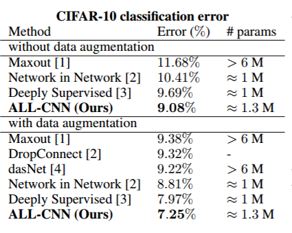
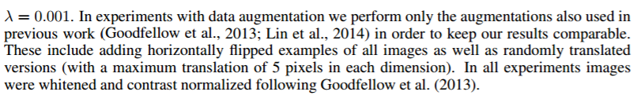
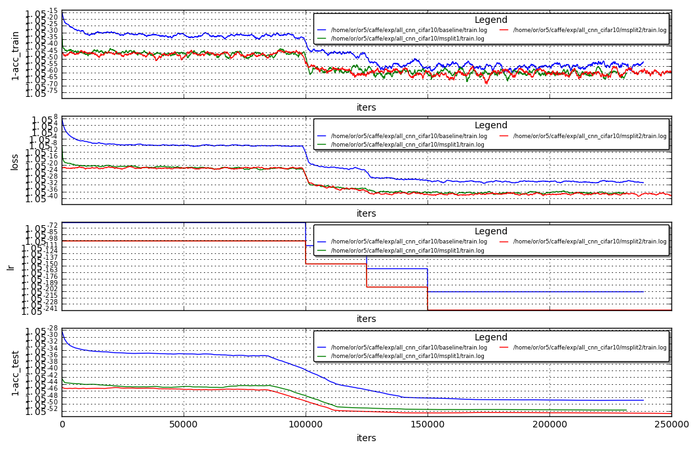

# ALL CNN cifar10 case study

These are the reported results on https://arxiv.org/pdf/1412.6806.pdf



Where regarding data augmentaion they write the following:



this is a reference reproduction by neon : 
https://gist.github.com/nervanazoo/47198f475260e77f64fe#performance<br>
where according to them :

```
Performance

This model is acheiving 89.5% top-1 accuracy on the validation data set. This is done using zca whitened, global contrast normalized data, without crops or flips. This is the same performance we achieve running the same model configuration and data through Caffe.
```

Another reference reproduction:<br>
http://stats.stackexchange.com/questions/198463/how-to-increase-accuracy-of-all-cnn-c-on-cifar-10-test-set

reporting 
```
I reimplemented all of it, now the accuracy on CIFAR-10 test set is at 89.31%.

```

### ALL CNN reproduction

By following exactly the training as described in the paper including ZCA whitening and Global contrast normalization , with data augmentation of horizontal flip + random crop I was able to reach acc of **90.9% (which is what they reported in there paper without data augmentation)**<br>
this is the best result from several trails

### Residual Splits
taking the TPM in the interval 115k-130k at the last spike drop loss, see TPM entropy per layer:<br>


```
Mean TPM ratio entropy = 0.94987578215
('conv2', 96) 1.58599417727
('conv1', 96) 1.40085849641
('conv8', 192) 1.29573906855
('conv3', 96) 0.912044983988
('conv9', 10) 0.897945724857
('conv4', 192) 0.808174017251
('conv5', 192) 0.686581090236
('conv6', 192) 0.538267453228
('conv7', 192) 0.42327702756

```

splitting conv2,conv1_conv8(msplit1):


```python
%run ~/caffe/utils/plot_loss.py ~/or5/caffe/exp/all_cnn_cifar10/baseline/train.log \
                                       /home/or/or5/caffe/exp/all_cnn_cifar10/msplit1/train.log \
                                       /home/or/or5/caffe/exp/all_cnn_cifar10/msplit2/train.log \
                                       --no_refresh

```





Next split (msplit2)<br>
conv1_split2_residual_pre,conv1_split2,conv2_split2,conv2_split1:
###### LEGEND ("Layer_name","number_of_output_channels","numer_of_weights")  "TPM entropy"
```
Mean TPM ratio entropy = 1.09155515598
('conv1_split2_residual_post', 48, 2304) 1.9674680351
('conv2_split2_residual_post', 48, 2304) 1.80190424164
('conv1_split2_residual_pre', 48, 1296) 1.79701327343
('conv1_split2', 48, 1296) 1.51701696211
('conv8_split2_residual_post', 96, 9216) 1.45334650011
('conv8_reorder', 192, 36864) 1.42802929202
('conv2_split2', 48, 41472) 1.37169967084
('conv2_split1', 48, 41472) 1.29607066612
('conv1_split1', 48, 1296) 1.16915123746
('conv9', 10, 1920) 1.16828245018
('conv2_reorder', 96, 9216) 1.16055723552
('conv1_reorder', 96, 9216) 1.15076124461
('conv2_split2_residual_pre', 48, 41472) 0.949742446651
('conv3', 96, 82944) 0.825414507069
('conv8_split1', 96, 18432) 0.811380009578
('conv8_split2', 96, 18432) 0.767344270675
('conv8_split2_residual_pre', 96, 18432) 0.723908646299
('conv7', 192, 331776) 0.657418801849
('conv5', 192, 331776) 0.356101654402
('conv4', 192, 165888) 0.302376762507
('conv6', 192, 331776) 0.247670367379

```

Net | Best Acc
--- | --------
baseline | 90.9
msplit1  | 92.06
msplit2  | 92.47


```python
! cat ~/or5/caffe/exp/all_cnn_cifar10/baseline/train.log | grep "Test.*acc" | sort -nk 11 | tail -3
```

    I0313 01:47:21.414019 28581 solver.cpp:433]     Test net output #0: accuracy = 0.9088
    I0313 01:43:25.685817 28581 solver.cpp:433]     Test net output #0: accuracy = 0.9089
    I0313 01:44:59.658226 28581 solver.cpp:433]     Test net output #0: accuracy = 0.909


```python
! cat /home/or/or5/caffe/exp/all_cnn_cifar10/msplit1/train.log | grep "Test.*acc" | sort -nk 11 | tail -3
```

    I0313 07:15:09.530669  2388 solver.cpp:433]     Test net output #0: accuracy = 0.9204
    I0313 07:04:16.805647  2388 solver.cpp:433]     Test net output #0: accuracy = 0.9205
    I0313 05:43:55.464422  2388 solver.cpp:433]     Test net output #0: accuracy = 0.9206


```python
! cat /home/or/or5/caffe/exp/all_cnn_cifar10/msplit2/train.log | grep "Test.*acc" | sort -nk 11 | tail -3
```

    I0313 13:05:34.637715  6419 solver.cpp:433]     Test net output #0: accuracy = 0.9245
    I0313 12:53:45.582887  6419 solver.cpp:433]     Test net output #0: accuracy = 0.9246
    I0313 13:04:15.434536  6419 solver.cpp:433]     Test net output #0: accuracy = 0.9247

