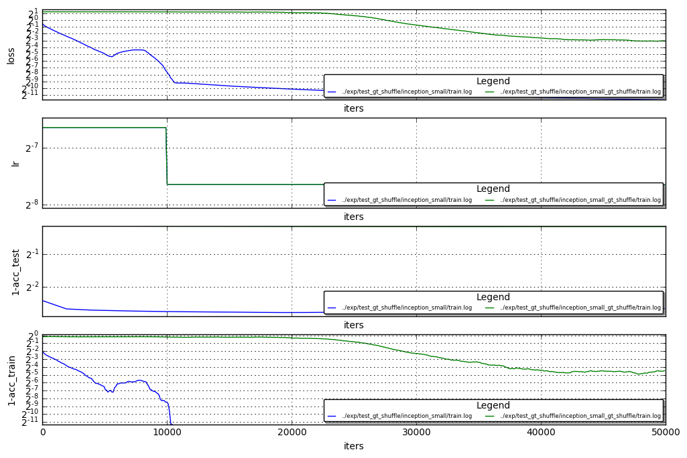

# GT shuffle test

Hi , got some interesting results on the GT shuffle test<br>
I'm not sure I can fully explain the results.<br>
however we do see a clear change in the way the loss is decreased (also shown in the paper),<br> and also in the TPM scores (could be correlated to the loss)

see below the loss and the accuracy on the train set:<br>
- true gt (blue curve) effectively finishes the train on iter 10000  with 99.951171875% acc 
- shuffled gt (green curve) struggles and only in 25000 start to effectively decrease the loss , reaching an accuracy of 96.87% on the train set    


```python
%run plot_loss.py ../exp/test_gt_shuffle/inception_small/train.log ../exp/test_gt_shuffle/inception_small_gt_shuffle/train.log
```





### TPM scores

in each test, The TPM on all of the layers behaves about the same, showing two conv layers:
- module1_inception_1x1 (shallow layer:closer to input)
- module4_inception_3x3 (deep layer : closer to output)

LEGEND : (window_start , window_stop) , layer_name , TPM 

#####  ordered (unshuffled) gt:
```
[((1000, 7000), ('module4_inception_3x3', 0.35065755024571388)),
 ((9000, 15000), ('module4_inception_3x3', 0.56788963727386643)),
 ((21000, 27000), ('module4_inception_3x3', 0.99936882382549241)), //end of training , very small coherent gradients
 ((29000, 35000), ('module4_inception_3x3', 0.99889381637217567)), //end of training , very small coherent gradients
 ((38000, 44000), ('module4_inception_3x3', 0.99749966775560406))] //end of training , very small coherent gradients
 
 [((1000, 7000), ('module1_inception_1x1', 0.40836040227807713)),
 ((9000, 15000), ('module1_inception_1x1', 0.69459297846079227)),
 ((21000, 27000), ('module1_inception_1x1', 0.9998604623514783)), //end of training , very small coherent gradients
 ((29000, 35000), ('module1_inception_1x1', 0.99983098823377625)), //end of training , very small coherent gradients
 ((38000, 44000), ('module1_inception_1x1', 0.9997143304078776))] //end of training , very small coherent gradients
``` 
 
#####  shuffled gt: 
```
[((1000, 7000), ('module4_inception_3x3', 0.8217826217179478)), // coherent gradients
 ((9000, 15000), ('module4_inception_3x3', 0.34371265996001066)), // balanced exploration <-> exploitation gradients 
 ((21000, 27000), ('module4_inception_3x3', 0.35213155521758172)), // balanced exploration <-> exploitation gradients 
 ((29000, 35000), ('module4_inception_3x3', 0.26993130117336184)), // balanced exploration <-> exploitation gradients 
 ((38000, 44000), ('module4_inception_3x3', 0.22208614579727912))] // balanced exploration <-> exploitation gradients 
 
 [((1000, 7000), ('module1_inception_1x1', 0.85660630566967477)),
 ((9000, 15000), ('module1_inception_1x1', 0.36086832825069076)),
 ((21000, 27000), ('module1_inception_1x1', 0.47382177722362812)),
 ((29000, 35000), ('module1_inception_1x1', 0.5740459508342638)),
 ((38000, 44000), ('module1_inception_1x1', 0.4648598917953955))]
```
### Trying to understand the direction of the grads in the shuffled gt iters (1000-7000)

We've seen that in the first phase of the shuffled gt test the gradient are consistent in direction (0.85 TPM)<br>
Unlike the ordered gt test end phase, the gradient also have high magnitude (due to loss being high)<br>

looking at the norm of the weights in selected layers<br>
LEGEND : (window_start , window_end) layer_name , norm_of_weights_in_window_start , norm_of_weights_in_window_end <br>
<br>
```
(1000,7000) module3_inception_1x1 2.63450789452 -> 1.66205918789
(1000,7000) module3_inception_3x3 4.81366014481 -> 2.75985240936
(9000,15000) module3_inception_1x1 1.59293782711 -> 2.26018500328
(9000,15000) module3_inception_3x3 2.43031716347 -> 2.6556968689
(21000,27000) module3_inception_1x1 3.17351984978 -> 5.23930072784
(21000,27000) module3_inception_3x3 3.60087299347 -> 6.36109209061
(29000,35000) module3_inception_1x1 6.27233123779 -> 7.4690284729
(29000,35000) module3_inception_3x3 7.71092796326 -> 9.24185562134
(38000,44000) module3_inception_1x1 7.40554189682 -> 6.94639730453
(38000,44000) module3_inception_3x3 9.18691062927 -> 8.66193675995
```

So the first response of the net to the shuffled gt train set is to decrease the net's weights L2Norm.<br>
It could be that the main driving force in the beginning of the train is the L2 Regularization, until the weights reaches a point when the loss can be reduced.<br>
