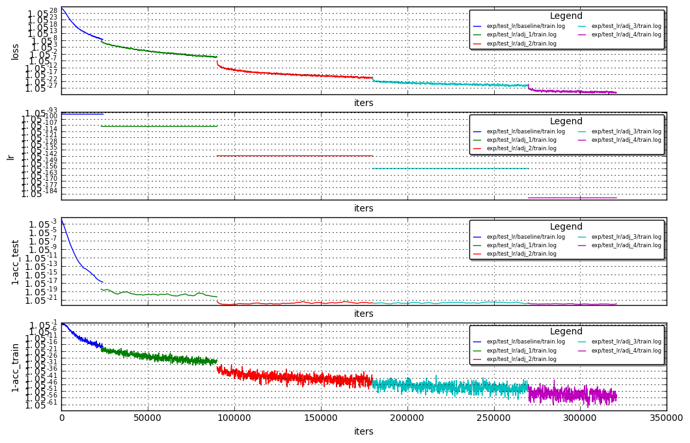

# Adjustable LR base on TrainPathMeasure

Hi , this is the summery of the experiments I've done on adjustable lr base on the TrainPathMeasure we've talked about.<br>
Bottom line, 0.6637 acc compared to the 0.6556 (best trail I got on the baseline)

These are the train stats on the 5 phases:
in each phase I've changed the Base Lr + did some manual lr adjustment to specific layers based on the TrainPathMeasure (will refer as TPM)


```python
%run utils/plot_loss.py  exp/test_lr/baseline/train.log  exp/test_lr/adj_1/train.log exp/test_lr/adj_2/train.log  exp/test_lr/adj_3/train.log exp/test_lr/adj_4/train.log --avg 5
```





these are the TrainPathMeasure through the stages showing all of the layer. (giving more concise summery below):<br>
`ledgend : path_<measure_window_start_iter>_<measure_window_start_iter> (<layer_name>: <TPM>)`


```python
! for f in `ls -C1 -tr exp/test_lr/path*` ; do grep -nH TrainPath $f ; done
```

    exp/test_lr/path_1000_7000_baseline.log:14196:TrainPathMeasure: ('clf', 0.48962990395029277)
    exp/test_lr/path_1000_7000_baseline.log:14197:TrainPathMeasure: ('conv1_1', 0.7564113420229529)
    exp/test_lr/path_1000_7000_baseline.log:14198:TrainPathMeasure: ('conv1_2', 0.61107629611371794)
    exp/test_lr/path_1000_7000_baseline.log:14199:TrainPathMeasure: ('conv1_3', 0.55966417499392196)
    exp/test_lr/path_1000_7000_baseline.log:14200:TrainPathMeasure: ('conv1_4', 0.57571081452403206)
    exp/test_lr/path_1000_7000_baseline.log:14201:TrainPathMeasure: ('conv1_5', 0.63421947875287954)
    exp/test_lr/path_1000_7000_baseline.log:14202:TrainPathMeasure: ('conv2_1', 0.54786784781190057)
    exp/test_lr/path_1000_7000_baseline.log:14203:TrainPathMeasure: ('conv2_2', 0.65254564544715365)
    exp/test_lr/path_1000_7000_baseline.log:14204:TrainPathMeasure: ('conv2_3', 0.61720129601488516)
    exp/test_lr/path_1000_7000_baseline.log:14205:TrainPathMeasure: ('conv2_4', 0.61146164128519986)
    exp/test_lr/path_1000_7000_baseline.log:14206:TrainPathMeasure: ('conv2_5', 0.55007778332958601)
    exp/test_lr/path_1000_7000_baseline.log:14207:TrainPathMeasure: ('conv2_6', 0.5077535717249525)
    exp/test_lr/path_1000_7000_baseline.log:14208:TrainPathMeasure: ('conv3_1', 0.52403047536766434)
    exp/test_lr/path_1000_7000_baseline.log:14209:TrainPathMeasure: ('conv3_2', 0.61707761487535573)
    exp/test_lr/path_1000_7000_baseline.log:14210:TrainPathMeasure: ('conv3_3', 0.60820335013694482)
    exp/test_lr/path_1000_7000_baseline.log:14211:TrainPathMeasure: ('conv3_4', 0.59833928967061489)
    exp/test_lr/path_1000_7000_baseline.log:14212:TrainPathMeasure: ('conv3_5', 0.54035276428194978)
    exp/test_lr/path_1000_7000_baseline.log:14213:TrainPathMeasure: ('conv3_6', 0.52065521666301073)
    exp/test_lr/path_1000_7000_baseline.log:14214:TrainPathMeasure: ('ip1', 0.44929511852987331)
    exp/test_lr/path_16500_23500.log:16372:TrainPathMeasure: ('clf', 0.22092872238326572)
    exp/test_lr/path_16500_23500.log:16373:TrainPathMeasure: ('conv1_1', 0.30844869742308789)
    exp/test_lr/path_16500_23500.log:16374:TrainPathMeasure: ('conv1_2', 0.30403295310638351)
    exp/test_lr/path_16500_23500.log:16375:TrainPathMeasure: ('conv1_3', 0.26647757557064838)
    exp/test_lr/path_16500_23500.log:16376:TrainPathMeasure: ('conv1_4', 0.27779150929385177)
    exp/test_lr/path_16500_23500.log:16377:TrainPathMeasure: ('conv1_5', 0.28722856394507296)
    exp/test_lr/path_16500_23500.log:16378:TrainPathMeasure: ('conv2_1', 0.25651180638337223)
    exp/test_lr/path_16500_23500.log:16379:TrainPathMeasure: ('conv2_2', 0.29676998953680445)
    exp/test_lr/path_16500_23500.log:16380:TrainPathMeasure: ('conv2_3', 0.27916672940654214)
    exp/test_lr/path_16500_23500.log:16381:TrainPathMeasure: ('conv2_4', 0.28177145086512323)
    exp/test_lr/path_16500_23500.log:16382:TrainPathMeasure: ('conv2_5', 0.27137226620332794)
    exp/test_lr/path_16500_23500.log:16383:TrainPathMeasure: ('conv2_6', 0.25635169657931067)
    exp/test_lr/path_16500_23500.log:16384:TrainPathMeasure: ('conv3_1', 0.25980591652828328)
    exp/test_lr/path_16500_23500.log:16385:TrainPathMeasure: ('conv3_2', 0.2897318165629858)
    exp/test_lr/path_16500_23500.log:16386:TrainPathMeasure: ('conv3_3', 0.29038550474396169)
    exp/test_lr/path_16500_23500.log:16387:TrainPathMeasure: ('conv3_4', 0.29346843280669632)
    exp/test_lr/path_16500_23500.log:16388:TrainPathMeasure: ('conv3_5', 0.28209318568386182)
    exp/test_lr/path_16500_23500.log:16389:TrainPathMeasure: ('conv3_6', 0.26809275940906813)
    exp/test_lr/path_16500_23500.log:16390:TrainPathMeasure: ('ip1', 0.22795910312665041)
    exp/test_lr/path_23000_30000.log:9844:TrainPathMeasure: ('clf', 0.2932794810938244)
    exp/test_lr/path_23000_30000.log:9845:TrainPathMeasure: ('conv1_1', 0.33468619002775163)
    exp/test_lr/path_23000_30000.log:9846:TrainPathMeasure: ('conv1_2', 0.34714380851373916)
    exp/test_lr/path_23000_30000.log:9847:TrainPathMeasure: ('conv1_3', 0.31371571346417776)
    exp/test_lr/path_23000_30000.log:9848:TrainPathMeasure: ('conv1_4', 0.31614679462238021)
    exp/test_lr/path_23000_30000.log:9849:TrainPathMeasure: ('conv1_5', 0.31957314063136416)
    exp/test_lr/path_23000_30000.log:9850:TrainPathMeasure: ('conv2_1', 0.29826313514577746)
    exp/test_lr/path_23000_30000.log:9851:TrainPathMeasure: ('conv2_2', 0.32904196976106781)
    exp/test_lr/path_23000_30000.log:9852:TrainPathMeasure: ('conv2_3', 0.3226949738997586)
    exp/test_lr/path_23000_30000.log:9853:TrainPathMeasure: ('conv2_4', 0.32620763001657721)
    exp/test_lr/path_23000_30000.log:9854:TrainPathMeasure: ('conv2_5', 0.31584851955272819)
    exp/test_lr/path_23000_30000.log:9855:TrainPathMeasure: ('conv2_6', 0.30877409888186214)
    exp/test_lr/path_23000_30000.log:9856:TrainPathMeasure: ('conv3_1', 0.30668348739885443)
    exp/test_lr/path_23000_30000.log:9857:TrainPathMeasure: ('conv3_2', 0.33020762154315469)
    exp/test_lr/path_23000_30000.log:9858:TrainPathMeasure: ('conv3_3', 0.33268847700206822)
    exp/test_lr/path_23000_30000.log:9859:TrainPathMeasure: ('conv3_4', 0.33580980282648693)
    exp/test_lr/path_23000_30000.log:9860:TrainPathMeasure: ('conv3_5', 0.33145479388554483)
    exp/test_lr/path_23000_30000.log:9861:TrainPathMeasure: ('conv3_6', 0.32502287924070689)
    exp/test_lr/path_23000_30000.log:9862:TrainPathMeasure: ('ip1', 0.28347635135203336)
    exp/test_lr/path_83000_90000.log:8756:TrainPathMeasure: ('clf', 0.30628608258859724)
    exp/test_lr/path_83000_90000.log:8757:TrainPathMeasure: ('conv1_1', 0.27518900531510448)
    exp/test_lr/path_83000_90000.log:8758:TrainPathMeasure: ('conv1_2', 0.30767686760212465)
    exp/test_lr/path_83000_90000.log:8759:TrainPathMeasure: ('conv1_3', 0.28398359308561538)
    exp/test_lr/path_83000_90000.log:8760:TrainPathMeasure: ('conv1_4', 0.28623452506497477)
    exp/test_lr/path_83000_90000.log:8761:TrainPathMeasure: ('conv1_5', 0.2947752561136246)
    exp/test_lr/path_83000_90000.log:8762:TrainPathMeasure: ('conv2_1', 0.28684838361252118)
    exp/test_lr/path_83000_90000.log:8763:TrainPathMeasure: ('conv2_2', 0.28636422644956022)
    exp/test_lr/path_83000_90000.log:8764:TrainPathMeasure: ('conv2_3', 0.28073862600168209)
    exp/test_lr/path_83000_90000.log:8765:TrainPathMeasure: ('conv2_4', 0.28322091235782415)
    exp/test_lr/path_83000_90000.log:8766:TrainPathMeasure: ('conv2_5', 0.2868816175747706)
    exp/test_lr/path_83000_90000.log:8767:TrainPathMeasure: ('conv2_6', 0.29515546673833809)
    exp/test_lr/path_83000_90000.log:8768:TrainPathMeasure: ('conv3_1', 0.2912314272008103)
    exp/test_lr/path_83000_90000.log:8769:TrainPathMeasure: ('conv3_2', 0.2890985926869144)
    exp/test_lr/path_83000_90000.log:8770:TrainPathMeasure: ('conv3_3', 0.28759248973520229)
    exp/test_lr/path_83000_90000.log:8771:TrainPathMeasure: ('conv3_4', 0.29097387591613638)
    exp/test_lr/path_83000_90000.log:8772:TrainPathMeasure: ('conv3_5', 0.29698276474941171)
    exp/test_lr/path_83000_90000.log:8773:TrainPathMeasure: ('conv3_6', 0.30192438606202332)
    exp/test_lr/path_83000_90000.log:8774:TrainPathMeasure: ('ip1', 0.31909423911474438)
    exp/test_lr/path_90000_97000.log:8756:TrainPathMeasure: ('clf', 0.45542994749233723)
    exp/test_lr/path_90000_97000.log:8757:TrainPathMeasure: ('conv1_1', 0.39011553681624939)
    exp/test_lr/path_90000_97000.log:8758:TrainPathMeasure: ('conv1_2', 0.41424443309586562)
    exp/test_lr/path_90000_97000.log:8759:TrainPathMeasure: ('conv1_3', 0.44791876369970207)
    exp/test_lr/path_90000_97000.log:8760:TrainPathMeasure: ('conv1_4', 0.43432881421859237)
    exp/test_lr/path_90000_97000.log:8761:TrainPathMeasure: ('conv1_5', 0.43301541666183141)
    exp/test_lr/path_90000_97000.log:8762:TrainPathMeasure: ('conv2_1', 0.42770063655214974)
    exp/test_lr/path_90000_97000.log:8763:TrainPathMeasure: ('conv2_2', 0.42226872884011396)
    exp/test_lr/path_90000_97000.log:8764:TrainPathMeasure: ('conv2_3', 0.42750073009817613)
    exp/test_lr/path_90000_97000.log:8765:TrainPathMeasure: ('conv2_4', 0.42665137464573349)
    exp/test_lr/path_90000_97000.log:8766:TrainPathMeasure: ('conv2_5', 0.43094041536883543)
    exp/test_lr/path_90000_97000.log:8767:TrainPathMeasure: ('conv2_6', 0.42606039339890373)
    exp/test_lr/path_90000_97000.log:8768:TrainPathMeasure: ('conv3_1', 0.42560869507643107)
    exp/test_lr/path_90000_97000.log:8769:TrainPathMeasure: ('conv3_2', 0.43383733430163868)
    exp/test_lr/path_90000_97000.log:8770:TrainPathMeasure: ('conv3_3', 0.43628585215238785)
    exp/test_lr/path_90000_97000.log:8771:TrainPathMeasure: ('conv3_4', 0.43790872752627075)
    exp/test_lr/path_90000_97000.log:8772:TrainPathMeasure: ('conv3_5', 0.44435795821544921)
    exp/test_lr/path_90000_97000.log:8773:TrainPathMeasure: ('conv3_6', 0.44564118907645772)
    exp/test_lr/path_90000_97000.log:8774:TrainPathMeasure: ('ip1', 0.44813499251379796)
    exp/test_lr/path_173000_180000.log:8756:TrainPathMeasure: ('clf', 0.33708173724693885)
    exp/test_lr/path_173000_180000.log:8757:TrainPathMeasure: ('conv1_1', 0.32967178407279418)
    exp/test_lr/path_173000_180000.log:8758:TrainPathMeasure: ('conv1_2', 0.29378085441142421)
    exp/test_lr/path_173000_180000.log:8759:TrainPathMeasure: ('conv1_3', 0.29624701575640211)
    exp/test_lr/path_173000_180000.log:8760:TrainPathMeasure: ('conv1_4', 0.2969401506248992)
    exp/test_lr/path_173000_180000.log:8761:TrainPathMeasure: ('conv1_5', 0.31929858668247196)
    exp/test_lr/path_173000_180000.log:8762:TrainPathMeasure: ('conv2_1', 0.29481279610820654)
    exp/test_lr/path_173000_180000.log:8763:TrainPathMeasure: ('conv2_2', 0.28850605771363858)
    exp/test_lr/path_173000_180000.log:8764:TrainPathMeasure: ('conv2_3', 0.28380783523586495)
    exp/test_lr/path_173000_180000.log:8765:TrainPathMeasure: ('conv2_4', 0.28746418227502629)
    exp/test_lr/path_173000_180000.log:8766:TrainPathMeasure: ('conv2_5', 0.29435873512474126)
    exp/test_lr/path_173000_180000.log:8767:TrainPathMeasure: ('conv2_6', 0.31020490696585423)
    exp/test_lr/path_173000_180000.log:8768:TrainPathMeasure: ('conv3_1', 0.30777517617253919)
    exp/test_lr/path_173000_180000.log:8769:TrainPathMeasure: ('conv3_2', 0.29467325104062031)
    exp/test_lr/path_173000_180000.log:8770:TrainPathMeasure: ('conv3_3', 0.29246474416386548)
    exp/test_lr/path_173000_180000.log:8771:TrainPathMeasure: ('conv3_4', 0.29521837759367664)
    exp/test_lr/path_173000_180000.log:8772:TrainPathMeasure: ('conv3_5', 0.30097828477267285)
    exp/test_lr/path_173000_180000.log:8773:TrainPathMeasure: ('conv3_6', 0.32061476351722351)
    exp/test_lr/path_173000_180000.log:8774:TrainPathMeasure: ('ip1', 0.35086357031673854)
    exp/test_lr/path_180000_187000.log:8756:TrainPathMeasure: ('clf', 0.31714545754225015)
    exp/test_lr/path_180000_187000.log:8757:TrainPathMeasure: ('conv1_1', 0.30677373740384456)
    exp/test_lr/path_180000_187000.log:8758:TrainPathMeasure: ('conv1_2', 0.31253193095639953)
    exp/test_lr/path_180000_187000.log:8759:TrainPathMeasure: ('conv1_3', 0.32204665303285485)
    exp/test_lr/path_180000_187000.log:8760:TrainPathMeasure: ('conv1_4', 0.32919264231715112)
    exp/test_lr/path_180000_187000.log:8761:TrainPathMeasure: ('conv1_5', 0.34355265724088169)
    exp/test_lr/path_180000_187000.log:8762:TrainPathMeasure: ('conv2_1', 0.32518451203768417)
    exp/test_lr/path_180000_187000.log:8763:TrainPathMeasure: ('conv2_2', 0.3192119705296988)
    exp/test_lr/path_180000_187000.log:8764:TrainPathMeasure: ('conv2_3', 0.31869211173835327)
    exp/test_lr/path_180000_187000.log:8765:TrainPathMeasure: ('conv2_4', 0.32036624697529897)
    exp/test_lr/path_180000_187000.log:8766:TrainPathMeasure: ('conv2_5', 0.32454247837791683)
    exp/test_lr/path_180000_187000.log:8767:TrainPathMeasure: ('conv2_6', 0.33876291909026607)
    exp/test_lr/path_180000_187000.log:8768:TrainPathMeasure: ('conv3_1', 0.33718708581284679)
    exp/test_lr/path_180000_187000.log:8769:TrainPathMeasure: ('conv3_2', 0.32880511356678294)
    exp/test_lr/path_180000_187000.log:8770:TrainPathMeasure: ('conv3_3', 0.33160998506597972)
    exp/test_lr/path_180000_187000.log:8771:TrainPathMeasure: ('conv3_4', 0.33303836629850431)
    exp/test_lr/path_180000_187000.log:8772:TrainPathMeasure: ('conv3_5', 0.3439707154867836)
    exp/test_lr/path_180000_187000.log:8773:TrainPathMeasure: ('conv3_6', 0.36037261424064387)
    exp/test_lr/path_180000_187000.log:8774:TrainPathMeasure: ('ip1', 0.33324731897103271)
    exp/test_lr/path_263000_270000.log:8756:TrainPathMeasure: ('clf', 0.31555149476376193)
    exp/test_lr/path_263000_270000.log:8757:TrainPathMeasure: ('conv1_1', 0.28269625880343136)
    exp/test_lr/path_263000_270000.log:8758:TrainPathMeasure: ('conv1_2', 0.2846781793998483)
    exp/test_lr/path_263000_270000.log:8759:TrainPathMeasure: ('conv1_3', 0.29081378673763114)
    exp/test_lr/path_263000_270000.log:8760:TrainPathMeasure: ('conv1_4', 0.29915689294485354)
    exp/test_lr/path_263000_270000.log:8761:TrainPathMeasure: ('conv1_5', 0.32289684658698448)
    exp/test_lr/path_263000_270000.log:8762:TrainPathMeasure: ('conv2_1', 0.29205119747022862)
    exp/test_lr/path_263000_270000.log:8763:TrainPathMeasure: ('conv2_2', 0.28366309845363813)
    exp/test_lr/path_263000_270000.log:8764:TrainPathMeasure: ('conv2_3', 0.28476128269969675)
    exp/test_lr/path_263000_270000.log:8765:TrainPathMeasure: ('conv2_4', 0.28476115019222431)
    exp/test_lr/path_263000_270000.log:8766:TrainPathMeasure: ('conv2_5', 0.2897166661228433)
    exp/test_lr/path_263000_270000.log:8767:TrainPathMeasure: ('conv2_6', 0.31586059736374783)
    exp/test_lr/path_263000_270000.log:8768:TrainPathMeasure: ('conv3_1', 0.309786517786871)
    exp/test_lr/path_263000_270000.log:8769:TrainPathMeasure: ('conv3_2', 0.29497219466613567)
    exp/test_lr/path_263000_270000.log:8770:TrainPathMeasure: ('conv3_3', 0.294000778204905)
    exp/test_lr/path_263000_270000.log:8771:TrainPathMeasure: ('conv3_4', 0.29810027693451741)
    exp/test_lr/path_263000_270000.log:8772:TrainPathMeasure: ('conv3_5', 0.30487566881844891)
    exp/test_lr/path_263000_270000.log:8773:TrainPathMeasure: ('conv3_6', 0.32995541937241185)
    exp/test_lr/path_263000_270000.log:8774:TrainPathMeasure: ('ip1', 0.32516004252774827)


let's review the train path measure on conv1_1,ip,conv2_1


```python
! for f in `ls -C1 -tr exp/test_lr/path*` ; do grep -nH "TrainPath" $f | grep "conv1_1\|ip\|conv2_1"; done
```

    exp/test_lr/path_1000_7000_baseline.log:14197:TrainPathMeasure: ('conv1_1', 0.7564113420229529)
    exp/test_lr/path_1000_7000_baseline.log:14202:TrainPathMeasure: ('conv2_1', 0.54786784781190057)
    exp/test_lr/path_1000_7000_baseline.log:14214:TrainPathMeasure: ('ip1', 0.44929511852987331)
    exp/test_lr/path_16500_23500.log:16373:TrainPathMeasure: ('conv1_1', 0.30844869742308789)
    exp/test_lr/path_16500_23500.log:16378:TrainPathMeasure: ('conv2_1', 0.25651180638337223)
    exp/test_lr/path_16500_23500.log:16390:TrainPathMeasure: ('ip1', 0.22795910312665041)
    exp/test_lr/path_23000_30000.log:9845:TrainPathMeasure: ('conv1_1', 0.33468619002775163)
    exp/test_lr/path_23000_30000.log:9850:TrainPathMeasure: ('conv2_1', 0.29826313514577746)
    exp/test_lr/path_23000_30000.log:9862:TrainPathMeasure: ('ip1', 0.28347635135203336)
    exp/test_lr/path_83000_90000.log:8757:TrainPathMeasure: ('conv1_1', 0.27518900531510448)
    exp/test_lr/path_83000_90000.log:8762:TrainPathMeasure: ('conv2_1', 0.28684838361252118)
    exp/test_lr/path_83000_90000.log:8774:TrainPathMeasure: ('ip1', 0.31909423911474438)
    exp/test_lr/path_90000_97000.log:8757:TrainPathMeasure: ('conv1_1', 0.39011553681624939)
    exp/test_lr/path_90000_97000.log:8762:TrainPathMeasure: ('conv2_1', 0.42770063655214974)
    exp/test_lr/path_90000_97000.log:8774:TrainPathMeasure: ('ip1', 0.44813499251379796)
    exp/test_lr/path_173000_180000.log:8757:TrainPathMeasure: ('conv1_1', 0.32967178407279418)
    exp/test_lr/path_173000_180000.log:8762:TrainPathMeasure: ('conv2_1', 0.29481279610820654)
    exp/test_lr/path_173000_180000.log:8774:TrainPathMeasure: ('ip1', 0.35086357031673854)
    exp/test_lr/path_180000_187000.log:8757:TrainPathMeasure: ('conv1_1', 0.30677373740384456)
    exp/test_lr/path_180000_187000.log:8762:TrainPathMeasure: ('conv2_1', 0.32518451203768417)
    exp/test_lr/path_180000_187000.log:8774:TrainPathMeasure: ('ip1', 0.33324731897103271)
    exp/test_lr/path_263000_270000.log:8757:TrainPathMeasure: ('conv1_1', 0.28269625880343136)
    exp/test_lr/path_263000_270000.log:8762:TrainPathMeasure: ('conv2_1', 0.29205119747022862)
    exp/test_lr/path_263000_270000.log:8774:TrainPathMeasure: ('ip1', 0.32516004252774827)


### Adjustment 1 (Green Stage)
When the training starts (iters 1000-7000) all of the layers have relatively high TPM<br>
in iterations 16500-23500 we see that the TPM has decreased significantlly (on conv1_1 from 0.756->0.308)<br> suggesting that the base_lr of 0.01 was exploited -> need to move to a smalled lr <br> 
all of the layers exhibits the same behavior hence a cross-layer base_lr change is applied<br>
<br>
additionally we see that the ip,clf (the last two FC layers) are lagging , meaning they both have a lower TPM then the rest of the layers: TPM@conv1_1 = 0.756 , TPM@ip = 0.449 , so we lower the lr_rate at ip,and clf layers<br>

see below for the changes in the train hyperparams


```python
! diff -C 2 exp/test_lr/baseline/fitnet4_relu_lsuv.prototxt exp/test_lr/adj_1/fitnet4_relu_lsuv.prototxt
```

    *** exp/test_lr/baseline/fitnet4_relu_lsuv.prototxt	2017-02-24 10:50:36.223040397 +0200
    --- exp/test_lr/adj_1/fitnet4_relu_lsuv.prototxt	2017-02-24 11:19:42.687063586 +0200
    ***************
    *** 3,7 ****
      test_iter: 1000
      test_interval: 1000
    ! base_lr: 0.01
      gamma: 0.1
      weight_decay: 0.0005
    --- 3,7 ----
      test_iter: 1000
      test_interval: 1000
    ! base_lr: 0.005
      gamma: 0.1
      weight_decay: 0.0005
    ***************
    *** 14,18 ****
      max_iter: 90000
      
    ! snapshot: 500
      snapshot_prefix: "exp/test_lr/baseline/snapshots/fitnet4_relu_lsuv"
      solver_mode: GPU
    --- 14,18 ----
      max_iter: 90000
      
    ! snapshot: 1000
      snapshot_prefix: "exp/test_lr/baseline/snapshots/fitnet4_relu_lsuv"
      solver_mode: GPU
    ***************
    *** 720,728 ****
        top: "ip1"
        param {
    !     lr_mult: 1
           decay_mult: 1 
        }
        param {
    !     lr_mult: 1
          decay_mult: 0
        }
    --- 720,728 ----
        top: "ip1"
        param {
    !     lr_mult: 0.5
           decay_mult: 1 
        }
        param {
    !     lr_mult: 0.5
          decay_mult: 0
        }
    ***************
    *** 763,771 ****
        top: "clf"
        param {
    !     lr_mult: 1
           decay_mult: 1 
        }
        param {
    !     lr_mult: 1
          decay_mult: 0
        }
    --- 763,771 ----
        top: "clf"
        param {
    !     lr_mult: 0.5
           decay_mult: 1 
        }
        param {
    !     lr_mult: 0.5
          decay_mult: 0
        }


### Adjustment 2 (Red Stage)
- first we note that measuring the TPM right after the first adjustment (iters 23000 - 30000) 
we see that overall the TPM is increased (TPM@conv1_1 = 0.308 -> 0.334) showing that with slight fix to the base_lr the training are now "more effective"  
- measuring the ratio of TPM@ip / TPM@conv1_1 = 0.228 / 0.308 = 0.74 -> 0.2834 / 0.3346 = 0.84 <br>
so the ratio of the TPM@ip / TPM@conv1_1 got closser to '1' then before due to the layer specific fix the lr

in the end of the "Adjustment 2 (Red Stage)" at iters (87000-90000) we see that the overall TPM is again reduced (compared to the start of the phase), suggesting to again decrease the base_lr (accross all layers)


this flow goes on to the next phase, the flow summery:
- when the TPM has lower below X, reduce the base_lr accross all layer (X is a strong function of the measurment window size)
- if some layers have lower/higher TPM  then the average TPM accross all layers , decrease/increase the layer specific lr

### Notes

- the measurement of the TPM is a strong function of the window size taken, in this test I've taken a window size of 7000 iters which are 11.6 epochs, taking a smaller window size gives high granularity temporal information about the Train path wheareas larger windows size measure the macro statistics of the train. (if we were to take a smaller window size we would have also see higher TPM values)
- as you can see the diversity of the TPM is relativly low , meaning most layers have about the same TPM , aside from few layers.<br> this is why in later stages I've started to measure the TPM on kernels of conv layers: (see below)

below you can see the histogram per layer of the TPM on the output channels, for example in conv1_1 there are 2 output channels with TPM ~0.16  and 8 output channels with TPM ~0.26.<br>
as you can see the stats here have much more diversity, however, in order to exploit this diversity I had to start splittig the conv layers.


```python
! python utils/train_path_hist.py --dep exp/test_lr/baseline/deploy.prototxt  --snapshot_dir exp/test_lr/baseline/snapshots/ --num 15 --range 83000,90000 2>&1 | grep -A 9999 Norm | grep -A 999 conv1_1  
```

    (2, 'conv1_1') with mean 0.280977524235
    # NumSamples = 32; Min = 0.15; Max = 0.39
    # each ∎ represents a count of 1
         0.1531 -     0.1769 [     2]: ∎∎ (6.25%)
         0.1769 -     0.2008 [     0]:  (0.00%)
         0.2008 -     0.2246 [     2]: ∎∎ (6.25%)
         0.2246 -     0.2484 [     3]: ∎∎∎ (9.38%)
         0.2484 -     0.2722 [     8]: ∎∎∎∎∎∎∎∎ (25.00%)
         0.2722 -     0.2960 [     4]: ∎∎∎∎ (12.50%)
         0.2960 -     0.3198 [     7]: ∎∎∎∎∎∎∎ (21.88%)
         0.3198 -     0.3437 [     3]: ∎∎∎ (9.38%)
         0.3437 -     0.3675 [     1]: ∎ (3.12%)
         0.3675 -     0.3913 [     2]: ∎∎ (6.25%)
    (4, 'conv1_2') with mean 0.305960684669
    # NumSamples = 32; Min = 0.25; Max = 0.36
    # each ∎ represents a count of 1
         0.2453 -     0.2571 [     1]: ∎ (3.12%)
         0.2571 -     0.2689 [     2]: ∎∎ (6.25%)
         0.2689 -     0.2807 [     2]: ∎∎ (6.25%)
         0.2807 -     0.2925 [     4]: ∎∎∎∎ (12.50%)
         0.2925 -     0.3043 [     6]: ∎∎∎∎∎∎ (18.75%)
         0.3043 -     0.3161 [     6]: ∎∎∎∎∎∎ (18.75%)
         0.3161 -     0.3279 [     5]: ∎∎∎∎∎ (15.62%)
         0.3279 -     0.3397 [     3]: ∎∎∎ (9.38%)
         0.3397 -     0.3515 [     2]: ∎∎ (6.25%)
         0.3515 -     0.3633 [     1]: ∎ (3.12%)
    (6, 'conv1_3') with mean 0.285948386058
    # NumSamples = 32; Min = 0.25; Max = 0.35
    # each ∎ represents a count of 1
         0.2505 -     0.2602 [     2]: ∎∎ (6.25%)
         0.2602 -     0.2699 [     3]: ∎∎∎ (9.38%)
         0.2699 -     0.2796 [     7]: ∎∎∎∎∎∎∎ (21.88%)
         0.2796 -     0.2893 [    10]: ∎∎∎∎∎∎∎∎∎∎ (31.25%)
         0.2893 -     0.2990 [     4]: ∎∎∎∎ (12.50%)
         0.2990 -     0.3087 [     2]: ∎∎ (6.25%)
         0.3087 -     0.3184 [     2]: ∎∎ (6.25%)
         0.3184 -     0.3281 [     1]: ∎ (3.12%)
         0.3281 -     0.3378 [     0]:  (0.00%)
         0.3378 -     0.3475 [     1]: ∎ (3.12%)
    (8, 'conv1_4') with mean 0.289144562352
    # NumSamples = 48; Min = 0.23; Max = 0.34
    # each ∎ represents a count of 1
         0.2333 -     0.2437 [     2]: ∎∎ (4.17%)
         0.2437 -     0.2542 [     1]: ∎ (2.08%)
         0.2542 -     0.2646 [     5]: ∎∎∎∎∎ (10.42%)
         0.2646 -     0.2751 [     5]: ∎∎∎∎∎ (10.42%)
         0.2751 -     0.2855 [     8]: ∎∎∎∎∎∎∎∎ (16.67%)
         0.2855 -     0.2960 [     7]: ∎∎∎∎∎∎∎ (14.58%)
         0.2960 -     0.3065 [    11]: ∎∎∎∎∎∎∎∎∎∎∎ (22.92%)
         0.3065 -     0.3169 [     4]: ∎∎∎∎ (8.33%)
         0.3169 -     0.3274 [     1]: ∎ (2.08%)
         0.3274 -     0.3378 [     4]: ∎∎∎∎ (8.33%)
    (10, 'conv1_5') with mean 0.29524716939
    # NumSamples = 48; Min = 0.27; Max = 0.33
    # each ∎ represents a count of 1
         0.2684 -     0.2742 [     2]: ∎∎ (4.17%)
         0.2742 -     0.2801 [     4]: ∎∎∎∎ (8.33%)
         0.2801 -     0.2860 [     6]: ∎∎∎∎∎∎ (12.50%)
         0.2860 -     0.2919 [     8]: ∎∎∎∎∎∎∎∎ (16.67%)
         0.2919 -     0.2978 [    11]: ∎∎∎∎∎∎∎∎∎∎∎ (22.92%)
         0.2978 -     0.3037 [     5]: ∎∎∎∎∎ (10.42%)
         0.3037 -     0.3095 [     4]: ∎∎∎∎ (8.33%)
         0.3095 -     0.3154 [     5]: ∎∎∎∎∎ (10.42%)
         0.3154 -     0.3213 [     1]: ∎ (2.08%)
         0.3213 -     0.3272 [     2]: ∎∎ (4.17%)
    (14, 'conv2_1') with mean 0.288017887071
    # NumSamples = 80; Min = 0.26; Max = 0.33
    # each ∎ represents a count of 1
         0.2558 -     0.2635 [     9]: ∎∎∎∎∎∎∎∎∎ (11.25%)
         0.2635 -     0.2711 [     4]: ∎∎∎∎ (5.00%)
         0.2711 -     0.2787 [     9]: ∎∎∎∎∎∎∎∎∎ (11.25%)
         0.2787 -     0.2864 [    15]: ∎∎∎∎∎∎∎∎∎∎∎∎∎∎∎ (18.75%)
         0.2864 -     0.2940 [    13]: ∎∎∎∎∎∎∎∎∎∎∎∎∎ (16.25%)
         0.2940 -     0.3016 [    14]: ∎∎∎∎∎∎∎∎∎∎∎∎∎∎ (17.50%)
         0.3016 -     0.3093 [    10]: ∎∎∎∎∎∎∎∎∎∎ (12.50%)
         0.3093 -     0.3169 [     2]: ∎∎ (2.50%)
         0.3169 -     0.3245 [     1]: ∎ (1.25%)
         0.3245 -     0.3322 [     3]: ∎∎∎ (3.75%)
    (16, 'conv2_2') with mean 0.288418124122
    # NumSamples = 80; Min = 0.26; Max = 0.33
    # each ∎ represents a count of 1
         0.2574 -     0.2643 [     5]: ∎∎∎∎∎ (6.25%)
         0.2643 -     0.2712 [     8]: ∎∎∎∎∎∎∎∎ (10.00%)
         0.2712 -     0.2780 [    10]: ∎∎∎∎∎∎∎∎∎∎ (12.50%)
         0.2780 -     0.2849 [    12]: ∎∎∎∎∎∎∎∎∎∎∎∎ (15.00%)
         0.2849 -     0.2918 [    11]: ∎∎∎∎∎∎∎∎∎∎∎ (13.75%)
         0.2918 -     0.2987 [    15]: ∎∎∎∎∎∎∎∎∎∎∎∎∎∎∎ (18.75%)
         0.2987 -     0.3056 [     6]: ∎∎∎∎∎∎ (7.50%)
         0.3056 -     0.3125 [     8]: ∎∎∎∎∎∎∎∎ (10.00%)
         0.3125 -     0.3194 [     3]: ∎∎∎ (3.75%)
         0.3194 -     0.3263 [     2]: ∎∎ (2.50%)
    (18, 'conv2_3') with mean 0.282801316841
    # NumSamples = 80; Min = 0.26; Max = 0.35
    # each ∎ represents a count of 1
         0.2563 -     0.2661 [     7]: ∎∎∎∎∎∎∎ (8.75%)
         0.2661 -     0.2758 [    19]: ∎∎∎∎∎∎∎∎∎∎∎∎∎∎∎∎∎∎∎ (23.75%)
         0.2758 -     0.2855 [    24]: ∎∎∎∎∎∎∎∎∎∎∎∎∎∎∎∎∎∎∎∎∎∎∎∎ (30.00%)
         0.2855 -     0.2953 [    16]: ∎∎∎∎∎∎∎∎∎∎∎∎∎∎∎∎ (20.00%)
         0.2953 -     0.3050 [    10]: ∎∎∎∎∎∎∎∎∎∎ (12.50%)
         0.3050 -     0.3147 [     3]: ∎∎∎ (3.75%)
         0.3147 -     0.3245 [     0]:  (0.00%)
         0.3245 -     0.3342 [     0]:  (0.00%)
         0.3342 -     0.3439 [     0]:  (0.00%)
         0.3439 -     0.3536 [     1]: ∎ (1.25%)
    (20, 'conv2_4') with mean 0.284131967155
    # NumSamples = 80; Min = 0.26; Max = 0.32
    # each ∎ represents a count of 1
         0.2577 -     0.2637 [     2]: ∎∎ (2.50%)
         0.2637 -     0.2697 [     7]: ∎∎∎∎∎∎∎ (8.75%)
         0.2697 -     0.2757 [    12]: ∎∎∎∎∎∎∎∎∎∎∎∎ (15.00%)
         0.2757 -     0.2817 [     9]: ∎∎∎∎∎∎∎∎∎ (11.25%)
         0.2817 -     0.2877 [    18]: ∎∎∎∎∎∎∎∎∎∎∎∎∎∎∎∎∎∎ (22.50%)
         0.2877 -     0.2937 [    19]: ∎∎∎∎∎∎∎∎∎∎∎∎∎∎∎∎∎∎∎ (23.75%)
         0.2937 -     0.2997 [     7]: ∎∎∎∎∎∎∎ (8.75%)
         0.2997 -     0.3057 [     3]: ∎∎∎ (3.75%)
         0.3057 -     0.3117 [     2]: ∎∎ (2.50%)
         0.3117 -     0.3177 [     1]: ∎ (1.25%)
    (22, 'conv2_5') with mean 0.287387264456
    # NumSamples = 80; Min = 0.26; Max = 0.32
    # each ∎ represents a count of 1
         0.2583 -     0.2647 [     3]: ∎∎∎ (3.75%)
         0.2647 -     0.2710 [     6]: ∎∎∎∎∎∎ (7.50%)
         0.2710 -     0.2774 [     6]: ∎∎∎∎∎∎ (7.50%)
         0.2774 -     0.2837 [    19]: ∎∎∎∎∎∎∎∎∎∎∎∎∎∎∎∎∎∎∎ (23.75%)
         0.2837 -     0.2901 [    14]: ∎∎∎∎∎∎∎∎∎∎∎∎∎∎ (17.50%)
         0.2901 -     0.2964 [    17]: ∎∎∎∎∎∎∎∎∎∎∎∎∎∎∎∎∎ (21.25%)
         0.2964 -     0.3028 [     7]: ∎∎∎∎∎∎∎ (8.75%)
         0.3028 -     0.3092 [     5]: ∎∎∎∎∎ (6.25%)
         0.3092 -     0.3155 [     2]: ∎∎ (2.50%)
         0.3155 -     0.3219 [     1]: ∎ (1.25%)
    (24, 'conv2_6') with mean 0.29563275514
    # NumSamples = 80; Min = 0.27; Max = 0.33
    # each ∎ represents a count of 1
         0.2700 -     0.2758 [     4]: ∎∎∎∎ (5.00%)
         0.2758 -     0.2816 [     4]: ∎∎∎∎ (5.00%)
         0.2816 -     0.2874 [    14]: ∎∎∎∎∎∎∎∎∎∎∎∎∎∎ (17.50%)
         0.2874 -     0.2932 [    15]: ∎∎∎∎∎∎∎∎∎∎∎∎∎∎∎ (18.75%)
         0.2932 -     0.2990 [    12]: ∎∎∎∎∎∎∎∎∎∎∎∎ (15.00%)
         0.2990 -     0.3048 [    17]: ∎∎∎∎∎∎∎∎∎∎∎∎∎∎∎∎∎ (21.25%)
         0.3048 -     0.3106 [     6]: ∎∎∎∎∎∎ (7.50%)
         0.3106 -     0.3164 [     3]: ∎∎∎ (3.75%)
         0.3164 -     0.3222 [     3]: ∎∎∎ (3.75%)
         0.3222 -     0.3280 [     2]: ∎∎ (2.50%)
    (28, 'conv3_1') with mean 0.29158671455
    # NumSamples = 128; Min = 0.26; Max = 0.31
    # each ∎ represents a count of 1
         0.2627 -     0.2679 [     2]: ∎∎ (1.56%)
         0.2679 -     0.2731 [     2]: ∎∎ (1.56%)
         0.2731 -     0.2782 [     5]: ∎∎∎∎∎ (3.91%)
         0.2782 -     0.2834 [    20]: ∎∎∎∎∎∎∎∎∎∎∎∎∎∎∎∎∎∎∎∎ (15.62%)
         0.2834 -     0.2886 [    19]: ∎∎∎∎∎∎∎∎∎∎∎∎∎∎∎∎∎∎∎ (14.84%)
         0.2886 -     0.2937 [    22]: ∎∎∎∎∎∎∎∎∎∎∎∎∎∎∎∎∎∎∎∎∎∎ (17.19%)
         0.2937 -     0.2989 [    29]: ∎∎∎∎∎∎∎∎∎∎∎∎∎∎∎∎∎∎∎∎∎∎∎∎∎∎∎∎∎ (22.66%)
         0.2989 -     0.3041 [    12]: ∎∎∎∎∎∎∎∎∎∎∎∎ (9.38%)
         0.3041 -     0.3092 [    14]: ∎∎∎∎∎∎∎∎∎∎∎∎∎∎ (10.94%)
         0.3092 -     0.3144 [     3]: ∎∎∎ (2.34%)
    (30, 'conv3_2') with mean 0.289796419461
    # NumSamples = 128; Min = 0.27; Max = 0.32
    # each ∎ represents a count of 1
         0.2690 -     0.2743 [     8]: ∎∎∎∎∎∎∎∎ (6.25%)
         0.2743 -     0.2797 [    11]: ∎∎∎∎∎∎∎∎∎∎∎ (8.59%)
         0.2797 -     0.2850 [    26]: ∎∎∎∎∎∎∎∎∎∎∎∎∎∎∎∎∎∎∎∎∎∎∎∎∎∎ (20.31%)
         0.2850 -     0.2903 [    28]: ∎∎∎∎∎∎∎∎∎∎∎∎∎∎∎∎∎∎∎∎∎∎∎∎∎∎∎∎ (21.88%)
         0.2903 -     0.2956 [    18]: ∎∎∎∎∎∎∎∎∎∎∎∎∎∎∎∎∎∎ (14.06%)
         0.2956 -     0.3009 [    21]: ∎∎∎∎∎∎∎∎∎∎∎∎∎∎∎∎∎∎∎∎∎ (16.41%)
         0.3009 -     0.3062 [     8]: ∎∎∎∎∎∎∎∎ (6.25%)
         0.3062 -     0.3115 [     3]: ∎∎∎ (2.34%)
         0.3115 -     0.3169 [     3]: ∎∎∎ (2.34%)
         0.3169 -     0.3222 [     2]: ∎∎ (1.56%)
    (32, 'conv3_3') with mean 0.288391454126
    # NumSamples = 128; Min = 0.26; Max = 0.31
    # each ∎ represents a count of 1
         0.2633 -     0.2681 [     2]: ∎∎ (1.56%)
         0.2681 -     0.2728 [     5]: ∎∎∎∎∎ (3.91%)
         0.2728 -     0.2776 [    15]: ∎∎∎∎∎∎∎∎∎∎∎∎∎∎∎ (11.72%)
         0.2776 -     0.2824 [     9]: ∎∎∎∎∎∎∎∎∎ (7.03%)
         0.2824 -     0.2871 [    18]: ∎∎∎∎∎∎∎∎∎∎∎∎∎∎∎∎∎∎ (14.06%)
         0.2871 -     0.2919 [    33]: ∎∎∎∎∎∎∎∎∎∎∎∎∎∎∎∎∎∎∎∎∎∎∎∎∎∎∎∎∎∎∎∎∎ (25.78%)
         0.2919 -     0.2967 [    23]: ∎∎∎∎∎∎∎∎∎∎∎∎∎∎∎∎∎∎∎∎∎∎∎ (17.97%)
         0.2967 -     0.3015 [    14]: ∎∎∎∎∎∎∎∎∎∎∎∎∎∎ (10.94%)
         0.3015 -     0.3062 [     4]: ∎∎∎∎ (3.12%)
         0.3062 -     0.3110 [     5]: ∎∎∎∎∎ (3.91%)
    (34, 'conv3_4') with mean 0.291843875819
    # NumSamples = 128; Min = 0.26; Max = 0.31
    # each ∎ represents a count of 1
         0.2643 -     0.2691 [     2]: ∎∎ (1.56%)
         0.2691 -     0.2739 [     5]: ∎∎∎∎∎ (3.91%)
         0.2739 -     0.2787 [     5]: ∎∎∎∎∎ (3.91%)
         0.2787 -     0.2835 [    12]: ∎∎∎∎∎∎∎∎∎∎∎∎ (9.38%)
         0.2835 -     0.2884 [    22]: ∎∎∎∎∎∎∎∎∎∎∎∎∎∎∎∎∎∎∎∎∎∎ (17.19%)
         0.2884 -     0.2932 [    25]: ∎∎∎∎∎∎∎∎∎∎∎∎∎∎∎∎∎∎∎∎∎∎∎∎∎ (19.53%)
         0.2932 -     0.2980 [    21]: ∎∎∎∎∎∎∎∎∎∎∎∎∎∎∎∎∎∎∎∎∎ (16.41%)
         0.2980 -     0.3028 [    16]: ∎∎∎∎∎∎∎∎∎∎∎∎∎∎∎∎ (12.50%)
         0.3028 -     0.3076 [    14]: ∎∎∎∎∎∎∎∎∎∎∎∎∎∎ (10.94%)
         0.3076 -     0.3124 [     6]: ∎∎∎∎∎∎ (4.69%)
    (36, 'conv3_5') with mean 0.297937455964
    # NumSamples = 128; Min = 0.27; Max = 0.32
    # each ∎ represents a count of 1
         0.2658 -     0.2713 [     1]: ∎ (0.78%)
         0.2713 -     0.2768 [     1]: ∎ (0.78%)
         0.2768 -     0.2824 [     7]: ∎∎∎∎∎∎∎ (5.47%)
         0.2824 -     0.2879 [    13]: ∎∎∎∎∎∎∎∎∎∎∎∎∎ (10.16%)
         0.2879 -     0.2934 [    21]: ∎∎∎∎∎∎∎∎∎∎∎∎∎∎∎∎∎∎∎∎∎ (16.41%)
         0.2934 -     0.2989 [    25]: ∎∎∎∎∎∎∎∎∎∎∎∎∎∎∎∎∎∎∎∎∎∎∎∎∎ (19.53%)
         0.2989 -     0.3044 [    24]: ∎∎∎∎∎∎∎∎∎∎∎∎∎∎∎∎∎∎∎∎∎∎∎∎ (18.75%)
         0.3044 -     0.3100 [    21]: ∎∎∎∎∎∎∎∎∎∎∎∎∎∎∎∎∎∎∎∎∎ (16.41%)
         0.3100 -     0.3155 [     9]: ∎∎∎∎∎∎∎∎∎ (7.03%)
         0.3155 -     0.3210 [     6]: ∎∎∎∎∎∎ (4.69%)
    (38, 'conv3_6') with mean 0.303115406395
    # NumSamples = 128; Min = 0.28; Max = 0.34
    # each ∎ represents a count of 1
         0.2806 -     0.2869 [     6]: ∎∎∎∎∎∎ (4.69%)
         0.2869 -     0.2933 [    20]: ∎∎∎∎∎∎∎∎∎∎∎∎∎∎∎∎∎∎∎∎ (15.62%)
         0.2933 -     0.2996 [    23]: ∎∎∎∎∎∎∎∎∎∎∎∎∎∎∎∎∎∎∎∎∎∎∎ (17.97%)
         0.2996 -     0.3060 [    34]: ∎∎∎∎∎∎∎∎∎∎∎∎∎∎∎∎∎∎∎∎∎∎∎∎∎∎∎∎∎∎∎∎∎∎ (26.56%)
         0.3060 -     0.3123 [    24]: ∎∎∎∎∎∎∎∎∎∎∎∎∎∎∎∎∎∎∎∎∎∎∎∎ (18.75%)
         0.3123 -     0.3187 [    11]: ∎∎∎∎∎∎∎∎∎∎∎ (8.59%)
         0.3187 -     0.3250 [     4]: ∎∎∎∎ (3.12%)
         0.3250 -     0.3314 [     3]: ∎∎∎ (2.34%)
         0.3314 -     0.3378 [     2]: ∎∎ (1.56%)
         0.3378 -     0.3441 [     1]: ∎ (0.78%)
    (42, 'ip1') with mean 0.322309179065
    # NumSamples = 500; Min = 0.26; Max = 0.94
    # each ∎ represents a count of 4
         0.2639 -     0.3319 [   344]: ∎∎∎∎∎∎∎∎∎∎∎∎∎∎∎∎∎∎∎∎∎∎∎∎∎∎∎∎∎∎∎∎∎∎∎∎∎∎∎∎∎∎∎∎∎∎∎∎∎∎∎∎∎∎∎∎∎∎∎∎∎∎∎∎∎∎∎∎∎∎∎∎∎∎∎∎∎∎∎∎∎∎∎∎∎∎ (68.80%)
         0.3319 -     0.3998 [   151]: ∎∎∎∎∎∎∎∎∎∎∎∎∎∎∎∎∎∎∎∎∎∎∎∎∎∎∎∎∎∎∎∎∎∎∎∎∎ (30.20%)
         0.3998 -     0.4678 [     3]:  (0.60%)
         0.4678 -     0.5357 [     0]:  (0.00%)
         0.5357 -     0.6037 [     1]:  (0.20%)
         0.6037 -     0.6716 [     0]:  (0.00%)
         0.6716 -     0.7396 [     0]:  (0.00%)
         0.7396 -     0.8075 [     0]:  (0.00%)
         0.8075 -     0.8755 [     0]:  (0.00%)
         0.8755 -     0.9434 [     1]:  (0.20%)
    (45, 'clf') with mean 0.309269974287
    # NumSamples = 100; Min = 0.27; Max = 0.36
    # each ∎ represents a count of 1
         0.2719 -     0.2812 [     5]: ∎∎∎∎∎ (5.00%)
         0.2812 -     0.2904 [    10]: ∎∎∎∎∎∎∎∎∎∎ (10.00%)
         0.2904 -     0.2997 [    18]: ∎∎∎∎∎∎∎∎∎∎∎∎∎∎∎∎∎∎ (18.00%)
         0.2997 -     0.3090 [    21]: ∎∎∎∎∎∎∎∎∎∎∎∎∎∎∎∎∎∎∎∎∎ (21.00%)
         0.3090 -     0.3183 [    17]: ∎∎∎∎∎∎∎∎∎∎∎∎∎∎∎∎∎ (17.00%)
         0.3183 -     0.3275 [    13]: ∎∎∎∎∎∎∎∎∎∎∎∎∎ (13.00%)
         0.3275 -     0.3368 [     6]: ∎∎∎∎∎∎ (6.00%)
         0.3368 -     0.3461 [     8]: ∎∎∎∎∎∎∎∎ (8.00%)
         0.3461 -     0.3554 [     1]: ∎ (1.00%)
         0.3554 -     0.3646 [     1]: ∎ (1.00%)


```python

```
