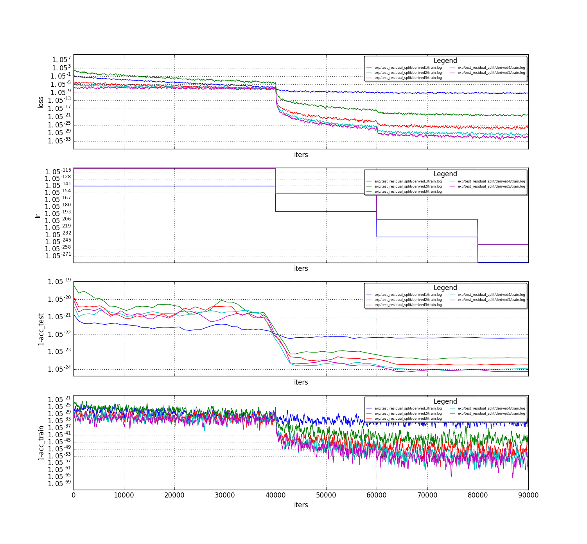

# Residual Split experiment


Hi , these are the results on the residual split test,
bottom line, see below results on accuracy per derived net: (showing improvement compared to the previous flow)

  Net  | Acc
  ------------- | -------------
  Baseline  | 0.653201
  Derived1  | 0.6617
  Derived2  | 0.6802
  Derived3  | 0.686
  Derived4  | 0.69
  Derived5  | 0.6914


```python
! grep -R -B 3 "Optimization Done" ../../caffe/exp/test_residual_split/* | grep accuracy
```

    ../../caffe/exp/test_residual_split/baseline/baseline_relu_lsuv.log-I0213 23:02:27.650948 26554 solver.cpp:408]     Test net output #0: accuracy = 0.653201
    ../../caffe/exp/test_residual_split/derived1/train.log-I0227 19:20:37.299788 15671 solver.cpp:433]     Test net output #0: accuracy = 0.6617
    ../../caffe/exp/test_residual_split/derived2/train.log-I0228 12:31:37.931709 24487 solver.cpp:433]     Test net output #0: accuracy = 0.6802
    ../../caffe/exp/test_residual_split/derived3/train.log-I0228 16:18:08.396566  9374 solver.cpp:433]     Test net output #0: accuracy = 0.686
    ../../caffe/exp/test_residual_split/derived4/train.log-I0228 21:50:04.230151 28318 solver.cpp:433]     Test net output #0: accuracy = 0.69
    ../../caffe/exp/test_residual_split/derived5/train.log-I0301 11:51:10.079383  8434 solver.cpp:433]     Test net output #0: accuracy = 0.6914


these were the results on the "previous split":

Net  | Acc
------------- | -------------
Baseline  | 0.653201
Derived1  | 0.661601
Derived2  | 0.6703
Derived3  | 0.682801
Derived4  | 0.683501
Derived5  | 0.6867
Derived6  | 0.681701   


```python
! grep -R -B 3 "Optimization Done" ../../caffe/exp/test_split3/* | grep accuracy
```

    ../../caffe/exp/test_split3/baseline/baseline_relu_lsuv.log-I0213 23:02:27.650948 26554 solver.cpp:408]     Test net output #0: accuracy = 0.653201
    ../../caffe/exp/test_split3/derived1/train.log-I0215 12:41:19.712880  4473 solver.cpp:433]     Test net output #0: accuracy = 0.661601
    ../../caffe/exp/test_split3/derived2/train.log-I0218 15:02:11.504654 31085 solver.cpp:433]     Test net output #0: accuracy = 0.6703
    ../../caffe/exp/test_split3/derived3/train.log-I0220 00:25:52.106156 11071 solver.cpp:433]     Test net output #0: accuracy = 0.682801
    ../../caffe/exp/test_split3/derived4/train.log-I0221 19:30:28.008002 24446 solver.cpp:433]     Test net output #0: accuracy = 0.683501
    ../../caffe/exp/test_split3/derived5/train.log-I0222 20:42:30.740097 32722 solver.cpp:433]     Test net output #0: accuracy = 0.6867
    ../../caffe/exp/test_split3/derived6/train.log-I0223 20:30:18.533768  3564 solver.cpp:433]     Test net output #0: accuracy = 0.681701


```python
%run /home/or/caffe/utils/plot_loss.py  /home/or/caffe/exp/test_residual_split/derived1/train.log  /home/or/caffe/exp/test_residual_split/derived2/train.log /home/or/caffe/exp/test_residual_split/derived3/train.log /home/or/caffe/exp/test_residual_split/derived4/train.log /home/or/caffe/exp/test_residual_split/derived5/train.log --avg 5
```





### Description of the split method

##### baseline

To be more specific, this is the description of the split:<br>
see below the process of producing the output blob conv1_1 , that is fed to the rest of the net.<br>
in the baseline conv1_1 is a convolution layer applied on the input image: (see below)


##### prev(old) split

this is how the conv1_1 was produce in the prev(old) split flow:<br>
conv1_1_split1 are the "fast" kernels (high TPM) , conv1_1_split2 are the "slower" kernels (lower TPM)<br>
conv1_1_split2 are fed to an "extention" conv layer with kernel size 1,<br>(initialized with identity matrix + noise)<br>
the concatenation of conv1_1_split1 , conv1_1_split2_extention is fed to a "reorder" conv layer with kernel size 1<br>(initialized with permuted identity matrix + noise , where the permutation is in order to preserve the previous conv1_1 convolution function)<br>
NOTE: if the noise in the initialization was zero, network mapping (the network output given an image) after the split was identical to the base network 


##### residual split

conv1_1_split1 are the "fast" kernels (high TPM) , conv1_1_split2 are the "slower" kernels (lower TPM)<br>
conv1_1_split2 is element wise summed with a residual path:<br>
the residual path is built from conv1_1_split2_residual_pre , (with identical kernel size to the conv1_1_split2) and a conv1_1_split2_residual_post with kernel_size =1 conv layer.<br>
<br>
Next, both splits are concatenated and reordered as before<br>
- The initialization of the conv1_1_split2_residual_post is a noisey identity matrix<br>
- The initialization of the conv1_1_split2_residual_pre is -0.2 * conv1_1_split2  + 2 * conv1_1_split2(spatial_center),<br>
meaning negative weights of the conv1_1_split2 , where only the center weight is positive.<br>
I did it in order to make the residual path more "edge preserving"<br>


<br>
NOTE: by this initialization I'm training to preserve the base net accuracy , meaning that the drop of the accuracy in the new generated net is about ~15%, (i.e. the training on the derived net start from 57% accuracy instead of 10% )
<br>
<br>
see below the visualization of the conv1_1_split2_residual_pre initialization:


