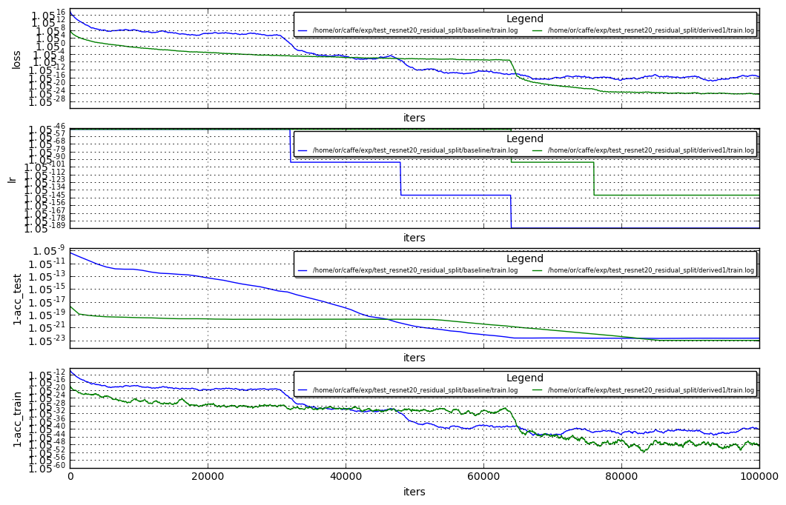

# Resnet20 Cifar100

Hi , after many (many , many , many ...) trails I've been able to improve the resnet20 on cifar100 baseline.
see results below (showing best trail) :

Net | Acc
--- | ---
Baseline | 0.6727
MultiSplits | 0.677

What I've learned:
- I've used to measure the TPM in the end of the baseline train, and do splits based on this measured TPMS.<br>
In the case on this baseline net, we can see that the majority of the learning is in iterations 40k-60k (see blue curve below).
so doing a split based on the TPM scores in the 40K - 50K provided more diversity and evidently provided better splits. effectively splitting in 50K and starting the derived net from the baseline 50K splitted net.<br><br>
- I've not been able to improve by doing a single iterative splits as before (in the previous baseline net a single split showed improvement consistently), I had to do 9 splits togther to improve the baseline.

From the number of trails I had to do to improve this baseline, it is evident that there were considerably less margins on this net to exploit. I'm not sure if this is a general resnet conclusion, or a specific conclusion to this baseline.

A possible greater potential would be to take a VGG like net and do splits and see if it is measurable to resnet archs.

NEXT: still working on reproducing the resnet50 on imagenet, will take considerable time , very slow training


```python
!grep Test /home/or/caffe/exp/test_resnet20_residual_split/baseline/train.log  | grep Acc | sort -nk 11 | tail -3
```

    I0305 16:47:02.008569 17823 solver.cpp:433]     Test net output #0: Accuracy = 0.6716
    I0305 16:26:21.747725 17823 solver.cpp:433]     Test net output #0: Accuracy = 0.6725
    I0305 16:24:53.513365 17823 solver.cpp:433]     Test net output #0: Accuracy = 0.6727


```python
!grep Test /home/or/caffe/exp/test_resnet20_residual_split/derived1/train.log  | grep Acc | sort -nk 11 | tail -3
```

    I0310 10:10:09.972316 13098 solver.cpp:433]     Test net output #0: Accuracy = 0.6769
    I0310 10:14:48.644430 13098 solver.cpp:433]     Test net output #0: Accuracy = 0.677
    I0310 11:05:58.447917 13098 solver.cpp:433]     Test net output #0: Accuracy = 0.677001


```python
%run ~/caffe/utils/plot_loss.py ~/caffe/exp/test_resnet20_residual_split/baseline/train.log ~/caffe/exp/test_resnet20_residual_split/derived1/train.log
```




